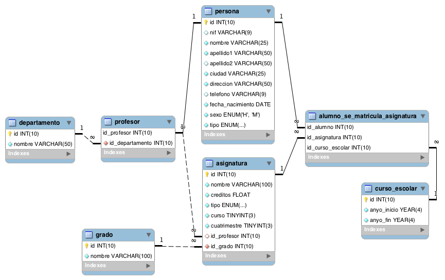

## 1.5.4 Consultas sobre una tabla


Devuelve un listado con el primer apellido, segundo apellido y el nombre de todos los alumnos. El listado deberá estar ordenado alfabéticamente de menor a mayor por el primer apellido, segundo apellido y nombre.

```sql
select p.apellido1  as 'primer apellido', p.apellido2 as 'segundo apellido' ,p.nombre as 'nombre' from persona p where tipo=lower('alumno') order by p.apellido1 , p.apellido2 ,p.nombre;

```

Averigua el nombre y los dos apellidos de los alumnos que no han dado de alta su número de teléfono en la base de datos.

```sql
select p.apellido1  as 'primer apellido', p.apellido2 as 'segundo apellido' ,p.nombre as 'nombre' from persona p where p.tipo=lower('alumno') and p.telefono is null  order by p.apellido1 , p.apellido2 ,p.nombre;
```

Devuelve el listado de los alumnos que nacieron en 1999.

```sql
select * from persona where tipo = lower('alumno') and year(fecha_nacimiento)=1999;
```
Devuelve el listado de profesores que no han dado de alta su número de teléfono en la base de datos y además su nif termina en K.


```sql
select * from persona where tipo = lower('profesor') and telefono is null and nif like '%k';
```

Devuelve el listado de las asignaturas que se imparten en el primer cuatrimestre, en el tercer curso del grado que tiene el identificador 7.

```sql
select * from asignatura where cuatrimestre =1 and curso =3 and id_grado =7 ; 
```

## 1.5.5 Consultas multitabla (Composición interna)
Devuelve un listado con los datos de todas las alumnas que se han matriculado alguna vez en el Grado en Ingeniería Informática (Plan 2015).
```sql
select p.* from alumno_se_matricula_asignatura asma
join asignatura ag on asma.id_asignatura = ag.id
join persona p on asma.id_alumno = p.id
join grado g on g.id =ag.id_grado 
where p.sexo =lower('m') and g.nombre =lower('Grado en Ingeniería Informática (Plan 2015)') and p.tipo = lower('alumno')
group by p.id ;
```

Devuelve un listado con todas las asignaturas ofertadas en el Grado en Ingeniería Informática (Plan 2015).
```sql
select * from asignatura a
join grado g on a.id_grado = g.id
where g.nombre = 'grado en Ingeniería Informática (Plan 2015)'
group by a.id ;
```

Devuelve un listado de los profesores junto con el nombre del departamento al que están vinculados. El listado debe devolver cuatro columnas, primer apellido, segundo apellido, nombre y nombre del departamento. El resultado estará ordenado alfabéticamente de menor a mayor por los apellidos y el nombre.

```sql
select 
p.apellido1 as 'primer apellido' ,
p.apellido2 as 'segundo apellido',
p.nombre as 'nombre profesor' , 
dp.nombre as  'nombre departamento'
from persona p
join profesor pf on p.id = pf.id_profesor
join departamento dp on  pf.id_departamento = dp.id
where tipo = 'profesor' order by p.nombre ,p.apellido1,p.apellido2 ;
```
Devuelve un listado con el nombre de las asignaturas, año de inicio y año de fin del curso escolar del alumno con nif 26902806M.


```sql
select p.nombre ,p.apellido1 ,
group_concat(' ( ',a.nombre,' ) ') as 'nombre asignatura ',
group_concat(DISTINCT anyo_inicio) as 'año inicio', 
group_concat(DISTINCT  ce.anyo_fin) as 'año fin'
from alumno_se_matricula_asignatura asma 
join persona  p on asma.id_alumno = p.id
join curso_escolar  ce on asma.id_curso_escolar = ce.id
join asignatura a on asma.id_asignatura =a.id
where p.nif = '26902806M'
group by p.nombre;
```

Devuelve un listado con el nombre de todos los departamentos que tienen profesores que imparten alguna asignatura en el Grado en Ingeniería Informática (Plan 2015).

```sql
select dp.nombre as 'nombre de los departamento' from departamento dp 
join profesor pf on dp.id =pf.id_departamento
join asignatura asg on pf.id_profesor = asg.id_profesor
join grado g on asg.id_grado = g.id 
where g.nombre ='Grado en Ingeniería Informática (Plan 2015)'
group by dp.nombre ;


```

Devuelve un listado con todos los alumnos que se han matriculado en alguna asignatura durante el curso escolar 2018/2019.

```sql
select p.* from 
alumno_se_matricula_asignatura asma
join persona p on asma.id_alumno = p.id
join curso_escolar ce on asma.id_curso_escolar = ce.id
where ce.anyo_inicio=2018 and ce.anyo_fin =2019 
group by p.id;
```

## 1.5.6 Consultas multitabla (Composición externa)Resuelva todas las consultas utilizando las cláusulas LEFT JOIN y RIGHT JOIN.

Devuelve un listado con los nombres de todos los profesores y los departamentos que tienen vinculados. El listado también debe mostrar aquellos profesores que no tienen ningún departamento asociado. El listado debe devolver cuatro columnas, nombre del departamento, primer apellido, segundo apellido y nombre del profesor. El resultado estará ordenado alfabéticamente de menor a mayor por el nombre del departamento, apellidos y el nombre.

```sql
select dp.nombre as 'nombre del departamento' ,
p.apellido1 as 'primer apellido' , 
p.apellido2 as 'segundo apellido' ,
p.nombre as 'nombre profesor'
from profesor pf
right join departamento dp on pf.id_departamento = dp.id
join persona p on pf.id_profesor = p.id
where p.tipo ='profesor'
order by dp.nombre ,p.apellido1 , p.apellido2 ;

```

Devuelve un listado con los profesores que no están asociados a un departamento.

```sql
select p.*
from profesor pf
right join departamento dp on pf.id_departamento = dp.id
join persona p on pf.id_profesor = p.id
where p.tipo ='profesor' and pf.id_departamento is null
order by dp.nombre ,p.apellido1 , p.apellido2 ;
```

Devuelve un listado con los departamentos que no tienen profesores asociados.
```sql
select dp.nombre from profesor pf
right join departamento dp on pf.id_departamento = dp.id 
where pf.id_departamento is null ;

```

Devuelve un listado con los profesores que no imparten ninguna asignatura.
```sql
select p.* from profesor pf
left join asignatura asg on pf.id_profesor = asg.id_profesor
join persona p on pf.id_profesor = p.id
where asg.id is null ;
```

Devuelve un listado con las asignaturas que no tienen un profesor asignado.
```sql
select p.* from profesor pf
left join asignatura asg on pf.id_profesor = asg.id_profesor
join persona p on pf.id_profesor = p.id
where asg.id is null ;
```

Devuelve un listado con todos los departamentos que tienen alguna asignatura que no se haya impartido en ningún curso escolar. El resultado debe mostrar el nombre del departamento y el nombre de la asignatura que no se haya impartido nunca.
```sql
select 
dp.nombre as 'nombre departamento' ,
asg.nombre as 'nombre asignatura' 
from alumno_se_matricula_asignatura asma
right join asignatura asg on asma.id_asignatura = asg.id
join profesor pf on asg.id_profesor =pf.id_profesor
join departamento dp on pf.id_departamento = dp.id
where asma.id_asignatura is null 
group by dp.nombre , asg.nombre ;
```

## 1.5.7 Consultas resumen


Devuelve el número total de alumnas que hay.
```sql
select count(*) as 'cantidad de alumnas' from persona p where p.tipo ='alumno' and p.sexo ='m' ;
```
Calcula cuántos alumnos nacieron en 1999.

```sql
select count(*) as 'cantidad de alumnos nacidos en 1999' from persona p where p.tipo ='alumno' and year(p.fecha_nacimiento)=1999 ;
```
Calcula cuántos profesores hay en cada departamento. El resultado sólo debe mostrar dos columnas, una con el nombre del departamento y otra con el número de profesores que hay en ese departamento. El resultado sólo debe incluir los departamentos que tienen profesores asociados y deberá estar ordenado de mayor a menor por el número de profesores.

```sql
select dp.nombre as 'nombre departamento' ,count(p.id_profesor) as 'cantidad de profesores por departamento' from departamento dp
join profesor p on dp.id = p.id_departamento
group by dp.nombre order by count(p.id_profesor) desc ;
```
Devuelve un listado con todos los departamentos y el número de profesores que hay en cada uno de ellos. Tenga en cuenta que pueden existir departamentos que no tienen profesores asociados. Estos departamentos también tienen que aparecer en el listado.
```sql
select dp.nombre as 'nombre departamento' , if( count(p.id_profesor)=0,'no tiene profesores asociados',count(p.id_profesor)) as 'cantidad de profesores por departamento' from departamento dp
left join profesor p on dp.id = p.id_departamento
group by dp.nombre order by count(p.id_profesor) desc ;
```

Devuelve un listado con el nombre de todos los grados existentes en la base de datos y el número de asignaturas que tiene cada uno. Tenga en cuenta que pueden existir grados que no tienen asignaturas asociadas. Estos grados también tienen que aparecer en el listado. El resultado deberá estar ordenado de mayor a menor por el número de asignaturas.

```sql
select g.nombre as 'nombre grado' ,
if(count(asg.id)=0,'no tiene asignatura asignada',count(asg.id))as 'numero asignaturas'
from grado g 
left join asignatura asg on g.id = asg.id_grado
group by(g.nombre) order by count(asg.id) desc; 
```

Devuelve un listado con el nombre de todos los grados existentes en la base de datos y el número de asignaturas que tiene cada uno, de los grados que tengan más de 40 asignaturas asociadas.

```sql
select g.nombre as 'nombre grado' ,count(asg.id) as 'numero asignaturas'
from grado g 
join asignatura asg on g.id = asg.id_grado
group by(g.nombre) 
HAVING count(asg.id)>40
order by count(asg.id) desc;
```

Devuelve un listado que muestre el nombre de los grados y la suma del número total de créditos que hay para cada tipo de asignatura. El resultado debe tener tres columnas: nombre del grado, tipo de asignatura y la suma de los créditos de todas las asignaturas que hay de ese tipo. Ordene el resultado de mayor a menor por el número total de crédidos.
```sql
select g.nombre as 'nombre de grado', asg.tipo as 'tipo asignatura' ,sum(asg.creditos) as 'suma de creditos' from grado g
join asignatura asg on g.id = asg.id_grado
group by g.nombre , asg.tipo 
order by sum(asg.creditos) desc ;
```

Devuelve un listado que muestre cuántos alumnos se han matriculado de alguna asignatura en cada uno de los cursos escolares. El resultado deberá mostrar dos columnas, una columna con el año de inicio del curso escolar y otra con el número de alumnos matriculados.

Devuelve un listado con el número de asignaturas que imparte cada profesor. El listado debe tener en cuenta aquellos profesores que no imparten ninguna asignatura. El resultado mostrará cinco columnas: id, nombre, primer apellido, segundo apellido y número de asignaturas. El resultado estará ordenado de mayor a menor por el número de asignaturas.

1.5.8 Subconsultas
Devuelve todos los datos del alumno más joven.

Devuelve un listado con los profesores que no están asociados a un departamento.

Devuelve un listado con los departamentos que no tienen profesores asociados.

Devuelve un listado con los profesores que tienen un departamento asociado y que no imparten ninguna asignatura.

Devuelve un listado con las asignaturas que no tienen un profesor asignado.

Devuelve un listado con todos los departamentos que no han impartido asignaturas en ningún curso escolar.