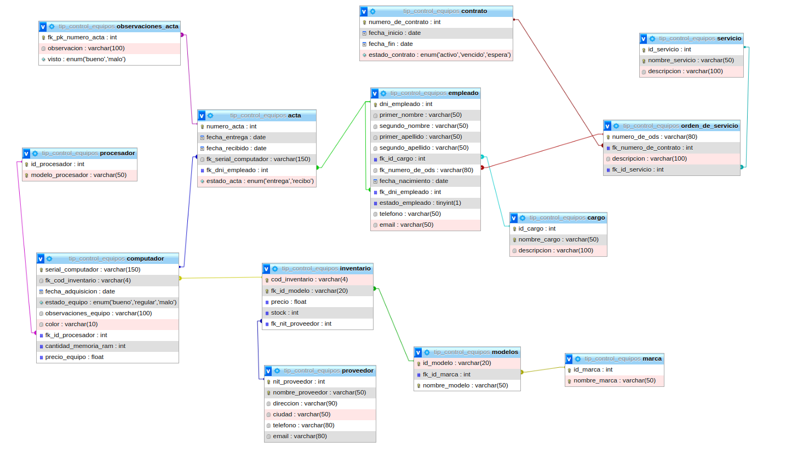

# Proyecto final modulo mysql

<h2 style='color:red;'> !⚠ Importante</h1>


##### `Esta base de datos es completamente real y está inspirada en la empresa donde realicé mis prácticas del SENA como auxiliar en sistemas.`

## Acerca del cliente
La empresa T.I.P., ubicada en Girón, Santander, es contratista de Ecopetrol y cuenta con un amplio repertorio en el análisis de aguas y análisis de procesos petroquímicos

## Problematica
El área de sistemas, responsable de suministrar equipos de cómputo a todos los empleados de la empresa, ha enfrentado desafíos significativos en la eficiencia de su proceso. En lugar de utilizar métodos óptimos, se ha mantenido la práctica de gestionar los suministros mediante bases de datos en formato de archivo plano, como Excel, o en hojas de papel que se archivan en carpetas. Este enfoque ha demostrado ser subóptimo, ya que no se respalda adecuadamente y, debido a la falta de organización, los datos se pierden con regularidad.

La ausencia de un respaldo sistemático y la pérdida constante de datos han ocasionado pérdidas financieras sustanciales para la empresa, superando los 12.000.000 millones de pesos anuales. Esta cifra representa los costos asociados con la reposición constante de equipos perdidos, lo cual se ha vuelto una necesidad debido a la falta de un sistema de gestión eficiente.

## Modelo conceptual 


La empresa está estructurada en varios contratos, que representan amplios grupos de trabajo. Cada contrato se asigna a subgrupos más pequeños llamados “órdenes de servicio” (ODS). Cada contrato especifica su número, así como las fechas de inicio y finalización, y el estado en el que se encuentra.

La gestión de las ODS es crucial, ya que cada una está vinculada exclusivamente a un contrato. Cada ODS detalla el número del contrato al que está asignada, su descripción y el servicio que se proporciona.

Además, se deben almacenar los datos de los empleados, incluyendo nombres, apellidos, cargo, jefe, fecha de nacimiento, estado laboral, teléfono, correo electrónico, entre otros detalles.

El inventario de equipos de cómputo se categoriza por marca y modelo, asegurando que cada computadora esté asignada a un único inventario. Cada computadora tiene detalles como color, fecha de adquisición, proveedor y estado del equipo, entre otros. Ten en cuenta que el proveedor es exclusivamente colombiano.

La empresa proporciona equipos de cómputo a los empleados a través de actas, que controlan la tenencia de los equipos. Cada acta se genera cuando el empleado ingresa y permanece activa hasta la finalización de su contrato, momento en el cual debe devolver el equipo. Las actas contienen información como la fecha de entrega, fecha de recepción, serial del computador entregado y el empleado al que se asigna.

Es importante señalar que el contrato asociado a las ODS no corresponde al contrato personal del empleado, sino que forma parte de la estructura interna de la empresa. Además, es necesario realizar revisiones cada vez que se entrega un equipo, indicando si este se encuentra en buen estado (“visto bueno”) o presenta alguna irregularidad (“malo”).


## Modelo logico


#### Tabla: empleado
- dni_empleado (PK, INT, NOT NULL)
- primer_nombre (VARCHAR(50), NOT NULL)
- segundo_nombre (VARCHAR(50), NULL)
- primer_apellido (VARCHAR(50), NOT NULL)
- segundo_apellido (VARCHAR(50), NULL)
- fk_id_cargo (FK, INT, NOT NULL)
- fk_numero_de_ods (FK, VARCHAR(80), NOT NULL)
- fecha_nacimiento (DATE, NOT NULL)
- fk_dni_empleado (FK, INT, NULL)
- estado_empleado (TINYINT(1), NOT NULL)
- telefono (VARCHAR(50), NOT NULL)
- email (VARCHAR(50), NULL)

#### Tabla: contrato
- numero_de_contrato (PK, INT, NOT NULL)
- fecha_inicio (DATE, NOT NULL)
- fecha_fin (DATE, NOT NULL)
- estado_contrato (ENUM('activo','vencido','espera'), NOT NULL)

#### Tabla: proveedor
- nit_proveedor (PK, INT, NOT NULL)
- nombre_proveedor (VARCHAR(50), NOT NULL)
- direccion (VARCHAR(90), NOT NULL)
- ciudad (VARCHAR(50), NOT NULL)
- telefono (VARCHAR(80), NOT NULL)
- email (VARCHAR(80), NULL)

#### Tabla: modelos
- id_modelo (PK, VARCHAR(20), NOT NULL)
- fk_id_marca (FK, INT, NOT NULL)
- nombre_modelo (VARCHAR(50), NOT NULL)

#### Tabla: inventario
- cod_inventario (PK, VARCHAR(4), NOT NULL)
- fk_id_modelo (FK, VARCHAR(20), NOT NULL)
- precio (FLOAT, NOT NULL)
- stock (INT, NOT NULL)
- fk_nit_proveedor (FK, INT, NOT NULL)

#### Tabla: servicio
- id_servicio (PK, INT, NOT NULL)
- nombre_servicio (VARCHAR(50), NOT NULL)
- descripcion (VARCHAR(100), NULL)

#### Tabla: acta
- numero_acta (PK, INT, NOT NULL)
- fecha_entrega (DATE, NOT NULL)
- fecha_recibido (DATE, NOT NULL)
- fk_serial_computador (FK, VARCHAR(150), NOT NULL)
- fk_dni_empleado (FK, INT, NOT NULL)
- estado_acta (ENUM('entrega','recibo'), NOT NULL)

#### Tabla: marca
- id_marca (PK, INT, NOT NULL)
- nombre_marca (VARCHAR(50), NOT NULL)

#### Tabla: observaciones_acta
- fk_pk_numero_acta (PK, FK, INT, NOT NULL)
- observacion (VARCHAR(100), NOT NULL)
- visto (ENUM('bueno','malo'), NOT NULL)

#### Tabla: procesador
- id_procesador (PK, INT, NOT NULL)
- modelo_procesador (VARCHAR(50), NOT NULL)

#### Tabla: orden_de_servicio
- numero_de_ods (PK, VARCHAR(80), NOT NULL)
- fk_numero_de_contrato (FK, INT, NOT NULL)
- descripcion (VARCHAR(100), NULL)
- fk_id_servicio (FK, INT, NOT NULL)

#### Tabla: cargo
- id_cargo (PK, INT, NOT NULL)
- nombre_cargo (VARCHAR(50), NOT NULL)
- descripcion (VARCHAR(100), NULL)

#### Tabla: computador
- serial_computador (PK, VARCHAR(150), NOT NULL)
- fk_cod_inventario (FK, VARCHAR(4), NOT NULL)
- fecha_adquisicion (DATE, NOT NULL)
- estado_equipo (ENUM('bueno','regular','malo'), NOT NULL)
- observaciones_equipo (VARCHAR(100), NULL)
- color (VARCHAR(10), NOT NULL)
- fk_id_procesador (FK, INT, NOT NULL)
- cantidad_memoria_ram (INT, NOT NULL)
- precio_equipo (FLOAT, NOT NULL)


##  Modelo fisico




# `Queris`

## tabla contrato 

### Crud 

#### insertar 
**1 -**  crear un nuevo contrato validando que no exista en la base de datos ademas cuidando de que sus fechas esten bien validadas
ademas ten encuenta manejar los errores posibles de cada validacion 
 para luego insertar un nuevo contrato a la tabla contrato

```sql

DROP PROCEDURE IF EXISTS insertar_contrato;

DELIMITER //
CREATE PROCEDURE insertar_contrato(IN numero_contrato INT, IN fecha_fin VARCHAR(20), IN estado_contrato VARCHAR(20))
BEGIN
    DECLARE validar_numero_contrato INT;
    DECLARE validar_fecha_fin DATE;

    SET validar_numero_contrato = (SELECT COUNT(*) FROM contrato c WHERE c.numero_de_contrato = numero_contrato);
    SET validar_fecha_fin = STR_TO_DATE(fecha_fin, '%Y-%m-%d');

    IF validar_numero_contrato = 0 THEN
        IF validar_fecha_fin IS NOT NULL THEN
            IF validar_fecha_fin > NOW() THEN
                IF estado_contrato = 'activo' OR estado_contrato = 'vencido' OR estado_contrato = 'espera' THEN
                    INSERT INTO contrato VALUES (numero_contrato, DATE_FORMAT(NOW(), '%Y-%m-%d '), validar_fecha_fin, estado_contrato);
                
                ELSE
                    SIGNAL SQLSTATE '45000' SET MESSAGE_TEXT = 'el estado que desea suministrar al contrato es errado';
                END IF;
            ELSE 
                SIGNAL SQLSTATE '45000' SET MESSAGE_TEXT = 'no se puede introducir una fecha posterior ala actual';
            END IF;
        ELSE 
             SIGNAL SQLSTATE '45000' SET MESSAGE_TEXT = 'formato de fecha incorrecta';
        END IF;
    ELSE
        SIGNAL SQLSTATE '45000' SET MESSAGE_TEXT = 'el contrato que desea agregar ya esta en la base de datos';
    END IF;

END //

DELIMITER ;

-- ejemplo
call insertar_contrato(13333,'2023-12-23','activo');


```

#### buscar 

**2 -** buscar un contrato por el codigo del mismo o su numero validando que este en la base de datos , y si hay un posible error manejalo


```sql

DROP PROCEDURE IF EXISTS buscar_contrato;

DELIMITER // 
CREATE PROCEDURE buscar_contrato(IN numero_contrato INT)
BEGIN
    SET @validar_numero_contrato = (SELECT COUNT(*) FROM contrato c WHERE c.numero_de_contrato = numero_contrato);

    IF @validar_numero_contrato = 0 THEN
        SIGNAL SQLSTATE '45000' SET MESSAGE_TEXT = 'El contrato que desea buscar no se encuentra en la base de datos';   
    ELSE
        SET @consulta_sql = CONCAT('SELECT * FROM contrato c WHERE c.numero_de_contrato = ', numero_contrato);
        PREPARE consulta_stmt FROM @consulta_sql;
        EXECUTE consulta_stmt;
        DEALLOCATE PREPARE consulta_stmt;
    END IF;
END //
DELIMITER ;

-- ejemplo 

call buscar_contrato (12333) ;
```

#### modificar

**3 -**  modificar un contrato solo por fecha fin verificando que el contrato este en la base de datos y que la fecha fin a introducir sea valida y que tenga coerencia ala hora de insertarla en la tabla contrato ten encuente multiples aspectos que se deben de tener como errores posibles y como se podrian manejar


```sql

DROP PROCEDURE IF EXISTS modificar_contrato;

DELIMITER // 
CREATE PROCEDURE modificar_contrato(IN numero_contrato INT , IN fecha_fin varchar(30))
BEGIN
    
    SET @validar_numero_contrato = (SELECT COUNT(*) FROM contrato c WHERE c.numero_de_contrato = numero_contrato);
    SET @validar_formato_fecha = STR_TO_DATE(fecha_fin, '%Y-%m-%d'); 
    SET @fecha_inicio = (SELECT  c.fecha_inicio  FROM contrato c WHERE c.numero_de_contrato  = numero_contrato);
    
    
     IF @validar_numero_contrato !=0 THEN 
    	IF @validar_formato_fecha IS NOT NULL THEN
        	IF @validar_formato_fecha > @fecha_inicio THEN 
        		UPDATE contrato SET fecha_fin = @validar_formato_fecha WHERE contrato.numero_de_contrato =  numero_contrato;
            ELSE    
     			SIGNAL SQLSTATE '45000'  SET  MESSAGE_TEXT = 'la fecha que desea introducir es menor que la fecha de inicio';
        	END IF ;
            
        ELSE    
     		SIGNAL SQLSTATE '45000'  SET  MESSAGE_TEXT = 'el formato de la fecha es incorrecto';
        END IF ;
     ELSE    
     	SIGNAL SQLSTATE '45000'  SET  MESSAGE_TEXT = 'el contrato que intenta modificar no se a encontrado';
     END IF ;
  
END //
DELIMITER ;

-- ejemplo 
CALL  modificar_contrato(1012313,'2024-12-31') ;


```

#### eliminar

**4 -** valida que el contrato este en la base de datos y si esta eliminalo para ello tambien se requiere manejar posibles errores


```sql
DROP PROCEDURE IF EXISTS eliminar_contrato;

DELIMITER // 
CREATE PROCEDURE eliminar_contrato(IN numero_contrato INT)
BEGIN
    
    SET @validar_numero_contrato = (SELECT COUNT(*) FROM contrato c WHERE c.numero_de_contrato = numero_contrato);
    
     IF @validar_numero_contrato !=0 THEN 
    	DELETE  FROM contrato WHERE contrato.numero_de_contrato = numero_contrato ;
     ELSE    
     	SIGNAL SQLSTATE '45000'  SET  MESSAGE_TEXT = 'el contrato que intenta eliminar no se a encontrado';
     END IF ;
  
END //
DELIMITER ;

-- ejemplo 

call  eliminar_contrato(1012313) ;

```
### **Queris de la tabla**
**5 -** modificar los estados de un contrato cuando la fecha actual coincida con la fecha fin

```sql

DROP TRIGGER IF EXISTS actualizar_estado_contrato ;

DELIMITER //
CREATE TRIGGER  actualizar_estado_contrato BEFORE UPDATE ON contrato
FOR EACH ROW BEGIN
	IF NEW.fecha_fin = CURDATE() THEN
        SET NEW.estado_contrato = 'vencido';
    END IF;
    
END //
DELIMITER ;

```


**6 -**  Devuelva el codigo de contrato o numero de contrato Y el numero de vistos malos  que han tenido los contratos a nivel de actas de empleado 


```sql

DROP PROCEDURE  IF EXISTS vistosMalos_contrato ;

DELIMITER // 

CREATE PROCEDURE vistosMalos_contrato()

BEGIN
	SELECT  c.numero_de_contrato , (
	SELECT COUNT(osba.fk_pk_numero_acta) FROM orden_de_servicio ods
    JOIN empleado em on ods.numero_de_ods = em.fk_numero_de_ods 
    JOIN acta act on em.dni_empleado = act.fk_dni_empleado 
    JOIN observaciones_acta osba on act.numero_acta = osba.fk_pk_numero_acta
    WHERE
    c.numero_de_contrato =ods.fk_numero_de_contrato AND osba.visto = 'malo'
   
) as total_vistos_malos
FROM contrato c WHERE c.numero_de_contrato  IN  (
	SELECT ods.fk_numero_de_contrato FROM orden_de_servicio ods
    JOIN empleado em on ods.numero_de_ods = em.fk_numero_de_ods 
    JOIN acta act on em.dni_empleado = act.fk_dni_empleado 
    JOIN observaciones_acta osba on act.numero_acta = osba.fk_pk_numero_acta
    WHERE osba.visto = 'malo' 
)GROUP BY c.numero_de_contrato ;

END //

DELIMITER ;


-- ejemplo 

CALL vistosMalos_contrato() ;

```

**7 -** devuelva el numero de contrato y la duracion

devuelva el número de contrato y la duración en días de todos los contratos activos que tienen una duración mayor a un año.

```sql
DROP PROCEDURE IF EXISTS contratos_activos_duracionDias ;

DELIMITER // 

CREATE PROCEDURE contratos_activos_duracionDias()

BEGIN
	SELECT numero_de_contrato, DATEDIFF(fecha_fin, fecha_inicio) AS duracion FROM contrato WHERE estado_contrato = 'activo' AND DATEDIFF(fecha_fin, fecha_inicio) > 365;
END //

DELIMITER ;

-- ejemplo 

CALL contratos_activos_duracionDias() ;

```


**8 -** devuelva el número de contrato y la duración en días de todos los contratos activos que tienen una duración mayor al promedio de duración de los contratos activos.

```sql

DROP PROCEDURE IF EXISTS contratos_activos_duracionDias_media ;
 
DELIMITER  // 

CREATE PROCEDURE contratos_activos_duracionDias_media()

BEGIN
       SELECT numero_de_contrato, DATEDIFF(fecha_fin, fecha_inicio) AS duracion FROM contrato WHERE estado_contrato = 'activo' AND DATEDIFF(fecha_fin, fecha_inicio) > (SELECT AVG(DATEDIFF(fecha_fin, fecha_inicio)) FROM contrato WHERE estado_contrato = 'activo');
END // 

DELIMITER ;

-- ejemplo
CALL contratos_activos_duracionDias_media() ;

``` 

**9 -** devuelva el codigo o numero de contrato que  han sido asignados al mayor número de ordenes de servicio

```sql

DROP PROCEDURE IF EXISTS  contrato_mayor_ordenes ;

DELIMITER // 


CREATE PROCEDURE contrato_mayor_ordenes ()

BEGIN
	SELECT c.numero_de_contrato FROM contrato c WHERE (SELECT COUNT(ods.numero_de_ods) FROM orden_de_servicio ods WHERE c.numero_de_contrato = ods.fk_numero_de_contrato) = (SELECT MAX(numero_ods) FROM (SELECT COUNT(ods.numero_de_ods) as numero_ods FROM orden_de_servicio ods GROUP BY ods.fk_numero_de_contrato) as numero_ods);
END // 

DELIMITER ;

-- ejemplo

CALL contrato_mayor_ordenes () ;

```


**10-** devuelva el codigo de los contratos  que tenga mas de 2 empleados asignados tambien se desea saber de todos estos contratos quien tiene mas personal laborando 
```sql
DROP PROCEDURE IF EXISTS  contrato_mayor_numero_empleados ;

DELIMITER  // 

CREATE PROCEDURE  contrato_mayor_numero_empleados()

BEGIN
	SELECT codigo_contrato FROM (SELECT c.numero_de_contrato as codigo_contrato , COUNT(emp.dni_empleado) as total_empleado_contrato FROM contrato c
JOIN orden_de_servicio ods on c.numero_de_contrato = ods.fk_numero_de_contrato
JOIN empleado emp on ods.numero_de_ods = emp.fk_numero_de_ods
GROUP BY c.numero_de_contrato 
HAVING COUNT(emp.dni_empleado)>2 ) tabla
ORDER BY total_empleado_contrato DESC LIMIT 1;
END // 

DELIMITER ;

-- ejemplo

CALL contrato_mayor_numero_empleados() ;
```


## Tabla servicios

### Crud

#### insertar

**1 -** inserte un servicio validando varios aspectos del mismo como  que el nombre del servicio  no lo tenga otro servicio que ya este en la base de datos  ademas validando que el mismo no contenga numeros implementando para esto manejo de errores 

```sql
DROP PROCEDURE IF EXISTS insertar_servicio;

DELIMITER //

CREATE PROCEDURE insertar_servicio(IN nombre_d_servicio VARCHAR(40), IN descripcion VARCHAR(100) )
BEGIN
    SET @validar_servicio = (SELECT COUNT(*) FROM servicio s WHERE s.nombre_servicio = nombre_d_servicio);

    IF @validar_servicio != 0 THEN
        SIGNAL SQLSTATE '45000' SET MESSAGE_TEXT = 'El servicio que desea añadir ya se encuentra en la base de datos';
    END IF;

    IF nombre_d_servicio NOT REGEXP '^[a-zA-Z][^0-9]*$' THEN
        SIGNAL SQLSTATE '45000' SET MESSAGE_TEXT = 'El nombre del servicio no debe contener números';
    ELSE
         IF descripcion IS NULL OR descripcion = '' THEN
            INSERT INTO servicio (nombre_servicio) VALUES (nombre_d_servicio);
        ELSE
            INSERT INTO servicio (nombre_servicio,descripcion)  VALUES (nombre_d_servicio, descripcion);
        END IF;
    END IF;
END //

DELIMITER ;

-- ejemplo
CALL insertar_servicio('lava papa', '')

```

#### buscar

**2-** busque los servicios por medio de su id de servicio trayendo un listado del mimo validando en el proceso de que el id a  buscar este en la base de datos y manejando para ello los errores   

```sql
DROP PROCEDURE IF EXISTS buscar_servicio;

DELIMITER //

CREATE PROCEDURE buscar_servicio(IN id_d_servicio INT)
BEGIN
    SET @validar_servicio = (SELECT COUNT(*) FROM servicio s WHERE s.id_servicio = id_d_servicio);
	
    IF @validar_servicio = 0 THEN
    	SIGNAL SQLSTATE '45000' SET MESSAGE_TEXT = 'No se encontro ningun dato el cual tenga el id mensionado' ;
    
    ELSE 
    	SET @consulta_sql = CONCAT('SELECT * FROM servicio s WHERE s.id_servicio = ', id_d_servicio);
        PREPARE consulta_stmt FROM @consulta_sql;
        EXECUTE consulta_stmt;
        DEALLOCATE PREPARE consulta_stmt;
        
    END IF ;
    
END //

DELIMITER ;

-- ejemplo 
CALL buscar_servicio(1);

```

#### modificar 


**3-** modifique los datos que pertenescan a un servicio buscandolo por su id y validando que este en al base de datos , solo se podra modificar el nombre del servicio y su descripcion ya que sea nula o quiera cambiar , manejando los posibles errores en el camino

```sql

DROP PROCEDURE IF EXISTS modificar_servicio;

DELIMITER //

CREATE PROCEDURE modificar_servicio(IN id_d_servicio INT  ,IN nombre_d_servicio VARCHAR(40), IN descripcion VARCHAR(100) )
BEGIN

	SET @buscar_servicio_x_id = (SELECT COUNT(*) FROM servicio s WHERE s.id_servicio = id_d_servicio);
	SET @validar_nombre_servicio = (SELECT COUNT(*) FROM servicio s WHERE s.nombre_servicio = nombre_d_servicio);
    

    IF @buscar_servicio_x_id = 0 THEN
        SIGNAL SQLSTATE '45000' SET MESSAGE_TEXT = 'El servicio que desea modificar no se encuentra en la base de datos';
    END IF;
		
    
    IF @validar_nombre_servicio !=0 THEN 
     SIGNAL SQLSTATE '45000' SET MESSAGE_TEXT = 'El nombre del servicio que desea usar ya se encuentra en la base de datos  por favor intente nuevamente ';
    END IF;
    

    IF nombre_d_servicio NOT REGEXP '^[a-zA-Z][^0-9]*$' THEN
        SIGNAL SQLSTATE '45000' SET MESSAGE_TEXT = 'El nombre del servicio no debe contener números';
    ELSE
         IF descripcion IS NULL OR descripcion = '' THEN
         		UPDATE servicio SET nombre_servicio = nombre_d_servicio WHERE id_servicio = id_d_servicio ; 
         ELSE
          		UPDATE servicio SET nombre_servicio = nombre_d_servicio  ,  servicio.descripcion = descripcion   WHERE id_servicio = id_d_servicio ; 
        END IF;
    END IF;
END //

DELIMITER ;

-- ejemplo
CALL modificar_servicio(5,'quiero papas','soy papero con honor') ;

```
#### eliminar

**4 -** elimine los servicios teniendo en cuenta su id  busquelo y validelo para saber si se encuentra en la base de datos este servicio y si este servicio se encuentra en la base de datos proceda a eliminarlo


```sql
DROP PROCEDURE IF EXISTS eliminar_servicio;

DELIMITER // 
CREATE PROCEDURE eliminar_servicio(IN id_d_servicio INT)
BEGIN
    
    SET @validar_servicio = (SELECT COUNT(*) FROM servicio s WHERE s.id_servicio = id_d_servicio );
    
    
    IF  @validar_servicio =0 THEN 
    	SIGNAL SQLSTATE '45000'  SET  MESSAGE_TEXT = 'el servicio que intenta eliminar no se a encontrado';
    ELSE
    	DELETE  FROM servicio WHERE id_servicio = id_d_servicio ;
    END IF ;
    
  
END //
DELIMITER ;

-- ejemplo
CALL eliminar_servicio(10) ; 
```


### **Queris de la tabla**

**5 -** devuelva el nombre servicio el  cual   este asignado el mayor número de ordenes de servicio:

```sql

DROP PROCEDURE IF EXISTS servicio_en_mas_ods ;

DELIMITER //  
CREATE PROCEDURE servicio_en_mas_ods()

BEGIN 
	SELECT s.nombre_servicio FROM servicio s 
    WHERE (SELECT COUNT(ods.numero_de_ods) FROM orden_de_servicio ods WHERE s.id_servicio = ods.fk_id_servicio) = (SELECT MAX(total_ods) FROM (SELECT COUNT(ods.numero_de_ods) as total_ods FROM orden_de_servicio ods GROUP BY ods.fk_id_servicio) as total_ods);
END //

DELIMITER ;

-- ejemplo
CALL servicio_en_mas_ods() ;
```


**6 -** Obtener el servicio que ha sido solicitado en más contratos activos y mostrar la cantidad de contratos en los que ha sido solicitado.

```sql
DROP PROCEDURE IF EXISTS servicio_mas_solicitados ;

DELIMITER // 

CREATE PROCEDURE servicio_mas_solicitados()
BEGIN 
	SELECT s.*, (
    SELECT COUNT(DISTINCT ods.fk_numero_de_contrato)
    FROM orden_de_servicio ods
    JOIN contrato c ON ods.fk_numero_de_contrato = c.numero_de_contrato
    WHERE ods.fk_id_servicio = s.id_servicio AND c.estado_contrato = 'activo'
    ) AS cantidad_contratos
    FROM servicio s
    ORDER BY cantidad_contratos DESC
    LIMIT 1;
END //
DELIMITER ;

-- ejemplo 
CALL servicio_mas_solicitados() ;

```

**7 -** devuelva el nombre del servicio los cuales sus descripciones terminen en consonante y que la longitud de sus descripciones sea impar

```sql
DROP PROCEDURE IF EXISTS servicios_long_impar 

DELIMITER // 

CREATE PROCEDURE servicios_long_impar()

BEGIN 
	SELECT nombre_servicio
	FROM servicio
	WHERE LENGTH(descripcion) % 2 = 1
  	AND descripcion REGEXP '[bcdfghjklmnpqrstvwxyz]$';
END // 

DELIMITER  ;


-- ejemplo 

CALL servicios_long_impar();


```

**8 -** devuelve un listado de los servicios con mas de 2 contratos solicitados

```sql

DROP PROCEDURE IF EXISTS servicios_mas_solicitado ; 

DELIMITER // 

CREATE PROCEDURE servicios_mas_solicitado()

BEGIN 
	SELECT s.*, (
    SELECT COUNT(DISTINCT ods.fk_numero_de_contrato)
    FROM orden_de_servicio ods
    WHERE ods.fk_id_servicio = s.id_servicio
) AS cantidad_contratos
FROM servicio s
WHERE (
    SELECT COUNT(DISTINCT ods.fk_numero_de_contrato)
    FROM orden_de_servicio ods
    WHERE ods.fk_id_servicio = s.id_servicio
) >=2;

END // 

DELIMITER  ;


-- ejemplo 

CALL servicios_mas_solicitado();


```

**9 -** devuelve un listado del servicio que cuyo id_servicio sea igual al id_servicio máximo de todos los servicios y cuyo nombre_servicio contenga la palabra recuperacion. Además, muestra el número total de servicios que tienen un id_servicio menor que el id_servicio máximo

```sql
DROP PROCEDURE IF EXISTS servicio_id_mayor; 

DELIMITER // 

CREATE PROCEDURE servicio_id_mayor()

BEGIN 
	SELECT *, (SELECT COUNT(*) FROM servicio WHERE id_servicio < (SELECT MAX(id_servicio) FROM servicio)) AS total_servicios FROM servicio WHERE id_servicio = (SELECT MAX(id_servicio) FROM servicio) AND nombre_servicio LIKE '%recuperacion%';

END // 

DELIMITER  ;


-- ejemplo 

CALL servicio_id_mayor();


```

## tabla orden de  servicio (ods)

### Crud


#### insertar 

**1 -** cree un procedimeinto de almacenado el cual valide posibles inserciones de ordenes de servicio valida que la orden que el usario quiera insertar no se encuentra en la base de  dato asi como validaste lo anterior reliza todas las validaciones correspondiente para esta tabla manejando en el camino los errores que se podrian presentar
```sql
DROP PROCEDURE IF EXISTS insertar_ods ;

DELIMITER  // 


CREATE PROCEDURE insertar_ods (IN numero_d_ods varchar(80),IN numero_d_contrato INT,IN descripcion varchar(100),IN id_servicio INT)

BEGIN
		SET @buscar_ods = (SELECT COUNT(*)  FROM orden_de_servicio ods WHERE ods.numero_de_ods = numero_d_ods );
        SET @buscar_contrato = (SELECT COUNT(*)  FROM contrato c WHERE c.numero_de_contrato = numero_d_contrato);
        SET @buscar_servicio = (SELECT COUNT(*)  FROM servicio s WHERE s.id_servicio = id_servicio);
        
        
        
        IF @buscar_ods != 0 THEN 
        	SIGNAL SQLSTATE '45000' SET MESSAGE_TEXT = 'la orden de servicio que desea agregar ya se encuentra en la base de datos' ;
        END IF ; 
        
        
        IF @buscar_contrato =0 THEN
        	SIGNAL SQLSTATE '45000' SET MESSAGE_TEXT = 'el numero de contrato a vincular no se encuentra en la base de datos' ;
        END IF ;
        
          IF @buscar_servicio =0 THEN
        	SIGNAL SQLSTATE '45000'  SET MESSAGE_TEXT = 'el numero de servicio a vincular no se encuentra en la base de datos' ;
            
          ELSE  
                IF descripcion IS NULL OR descripcion = '' THEN
                    INSERT INTO orden_de_servicio VALUES (numero_d_ods,numero_d_contrato,NULL,id_servicio) ;
                 ELSE
                 	 INSERT INTO orden_de_servicio VALUES (numero_d_ods,numero_d_contrato,descripcion,id_servicio) ;  
                END IF;
        END IF ;
        
END // 

DELIMITER  ;

-- ejemplo 
CALL insertar_ods('ODS2025',1302,'',2) ;

```

#### buscar 
**2 -** busque las ordenes de servicio por medio de su codigo de ods  trayendo un listado del mismo validando en el proceso de que el id a  buscar este en la base de datos y manejando posibles  errores 
```sql

DROP PROCEDURE IF EXISTS buscar_ods ;

DELIMITER  // 


CREATE PROCEDURE buscar_ods (IN numero_d_ods varchar(80))

BEGIN
		SET @buscar_ods = (SELECT COUNT(*)  FROM orden_de_servicio ods WHERE ods.numero_de_ods = numero_d_ods );
        
        
       
        IF @buscar_ods = 0 THEN 
        	SIGNAL SQLSTATE '45000' SET MESSAGE_TEXT = 'la orden de servicio que desea buscar  no se encuentra en la base de datos' ;
        
        ELSE 
        	SET @consulta_sql = CONCAT('SELECT * FROM orden_de_servicio ods WHERE ods.numero_de_ods = "', numero_d_ods, '"');
        	PREPARE consulta_stmt FROM @consulta_sql;
        	EXECUTE consulta_stmt;
        	DEALLOCATE PREPARE consulta_stmt;
        END IF ; 
          
        
END // 

DELIMITER  ;

-- ejemplo 
CALL buscar_ods('ODS2023001')


```

#### modificar 

**3 -**  modifique los datos que pertenescan a una orden de servicio o ods  buscandolo por su id o codigo  y validando que este en al base de datos , solo se podra modificar el numero de contrato ,descripcion y el servicio ala que pertenece la ods , ademas ten encuente los posibles errores 

```sql
DROP PROCEDURE IF EXISTS modificar_ods ;

DELIMITER  // 


CREATE PROCEDURE modificar_ods (IN numero_d_ods varchar(80),IN numero_d_contrato INT,IN descripcion varchar(100),IN id_servicio INT)

BEGIN
		SET @buscar_ods = (SELECT COUNT(*)  FROM orden_de_servicio ods WHERE ods.numero_de_ods = numero_d_ods );
        SET @buscar_contrato = (SELECT COUNT(*)  FROM contrato c WHERE c.numero_de_contrato = numero_d_contrato);
        SET @buscar_servicio = (SELECT COUNT(*)  FROM servicio s WHERE s.id_servicio = id_servicio);
        
        
        
        IF @buscar_ods = 0 THEN 
        	SIGNAL SQLSTATE '45000' SET MESSAGE_TEXT = 'la orden de servicio que desea modificar no se encuentra en la base de datos' ;
        END IF ; 
        
        
        IF @buscar_contrato =0 THEN
        	SIGNAL SQLSTATE '45000' SET MESSAGE_TEXT = 'el numero de contrato a vincular no se encuentra en la base de datos' ;
        END IF ;
        
          IF @buscar_servicio =0 THEN
        	SIGNAL SQLSTATE '45000'  SET MESSAGE_TEXT = 'el numero de servicio a vincular no se encuentra en la base de datos' ;
            
          ELSE  
                IF descripcion IS NULL OR descripcion = '' THEN
                	UPDATE orden_de_servicio SET fk_numero_de_contrato =numero_d_contrato , descripcion=NULL , fk_id_servicio = id_servicio where numero_de_ods = numero_d_ods  ;
                 ELSE
                 	 UPDATE orden_de_servicio SET fk_numero_de_contrato =numero_d_contrato , orden_de_servicio.descripcion=descripcion , fk_id_servicio = id_servicio  where numero_de_ods = numero_d_ods;
                END IF;
        END IF ;
        
END // 

DELIMITER  ;

-- ejemplo

CALL modificar_ods('ODS2023001',3221204,'',5);

```


#### eliminar 

**4-** elimine las ordenes de servicio (ods) teniendo en cuenta su id busquelo y validelo para saber si se encuentra en la base de datos esta ods y si se encuentra en la base de datos proceda a eliminarlo

```sql

DROP PROCEDURE IF EXISTS eliminar_ods;

DELIMITER // 
CREATE PROCEDURE eliminar_ods(IN numero_d_ods  varchar(80))
BEGIN
    
    SET @validar_ods = (SELECT COUNT(*) FROM orden_de_servicio ods WHERE ods.numero_de_ods = numero_d_ods);
    
     IF @validar_ods =0 THEN 
     	SIGNAL SQLSTATE '45000'  SET  MESSAGE_TEXT = 'la orden de servicio que intenta eliminar no se a encontrado';
    
     ELSE    
     	DELETE  FROM orden_de_servicio ods WHERE ods.numero_de_ods = numero_d_ods ;
     END IF ;
  
END //
DELIMITER ;
```
### **Queris de la tabla**

**5 -** devuelve un listado con los codigo o numeros de ods ala que mas empleados estan asociadas

```sql

DROP PROCEDURE IF EXISTS ods_mas_asociada; 

DELIMITER // 

CREATE PROCEDURE ods_mas_asociada()

BEGIN 
	SELECT numero_de_ods
FROM orden_de_servicio
WHERE fk_id_servicio IN (
    SELECT fk_id_servicio
    FROM empleado
    JOIN orden_de_servicio ON empleado.fk_numero_de_ods = orden_de_servicio.numero_de_ods
    WHERE dni_empleado = (
        SELECT dni_empleado
        FROM empleado
        GROUP BY dni_empleado
        ORDER BY COUNT(fk_numero_de_ods) DESC
        LIMIT 1
    )
); 
END // 

DELIMITER  ;


-- ejemplo 

CALL ods_mas_asociada() ;
```


**6 -**  devuelva las ordenes de servicio que tiene mas empleados asociados ademas que los  contratos se encuentren activos

```sql
DROP PROCEDURE IF EXISTS ods_mas_asoc_empActivos; 

DELIMITER // 

CREATE PROCEDURE  ods_mas_asoc_empActivos()

BEGIN 
	SELECT numero_de_ods,
    ( SELECT COUNT(*) FROM empleado WHERE fk_numero_de_ods = o.numero_de_ods ) 

    AS total_empleados_asociados FROM orden_de_servicio o WHERE o.fk_numero_de_contrato in (
        SELECT c.numero_de_contrato  FROM contrato  c
        WHERE c.estado_contrato = 'activo'

    );

END // 

DELIMITER  ;


-- ejemplo 

CALL ods_mas_asoc_empActivos() ;

```

**7 -** devuelva un listado con las ordenes de servicio las cuales tienen empleados que no tiene un acta formal de entrega de equipo de computo y que se encuentran empleados

```sql
DROP PROCEDURE IF EXISTS ods_emp_sinActa; 

DELIMITER // 

CREATE PROCEDURE  ods_emp_sinActa()

BEGIN 
	SELECT * FROM orden_de_servicio ods
    WHERE ods.numero_de_ods
    IN ( SELECT e.fk_numero_de_ods FROM empleado e WHERE e.dni_empleado
        not in ( SELECT act.fk_dni_empleado FROM acta act ) and e.estado_empleado = 1 );

END // 

DELIMITER  ;


-- ejemplo 

CALL ods_emp_sinActa() ;
```


**8 -** Listar las órdenes de servicio junto con la información del contrato asociado:

```sql
DROP PROCEDURE IF EXISTS ods_info;

DELIMITER  //

CREATE PROCEDURE  ods_info()

BEGIN 

SELECT
    ods.numero_de_ods,
    (
        SELECT numero_de_contrato
        FROM contrato
        WHERE numero_de_contrato = ods.fk_numero_de_contrato
    ) AS numero_de_contrato,
    (
        SELECT fecha_inicio
        FROM contrato
        WHERE numero_de_contrato = ods.fk_numero_de_contrato
    ) AS fecha_inicio,
    (
        SELECT fecha_fin
        FROM contrato
        WHERE numero_de_contrato = ods.fk_numero_de_contrato
    ) AS fecha_fin
FROM orden_de_servicio ods;

END //

DELIMITER ;

-- ejemplo
CALL ods_info () ;

```


**9 -**
```
```


## Tabla empleado 


### Crud 

#### insertar

**1-**  cree un procedimeinto de almacenado el cual valide posibles inserciones de  la tabla empleado validando los multiples datos que requiere la misma y manejando posibles casos de errores u exepciones


```sql

DROP PROCEDURE IF EXISTS  insertar_empleado ;

DELIMITER // 

CREATE PROCEDURE insertar_empleado(
    
    in dni_empleado int , 
    in primer_nombre varchar(50), 
    in segundo_nombre varchar(50),
    in primer_apellido varchar(50),
    in segundo_apellido varchar(50), 
    in  fk_id_cargo int ,
    in fk_numero_de_ods varchar(80), 
    in fecha_nacimiento varchar(20),
    in fk_dni_empleado int,
    in telefono varchar(50),
    in email varchar(50))

BEGIN 
	SET @validarEmpleado = (SELECT COUNT(*) FROM empleado e WHERE e.dni_empleado = dni_empleado);
   	SET @validarCargo = (SELECT COUNT(*) FROM cargo c WHERE c.id_cargo  = fk_id_cargo);
   	SET @validarOds = (SELECT COUNT(*) FROM orden_de_servicio ods WHERE ods.numero_de_ods  = fk_numero_de_ods);    
    SET @validarfk_dni_empleado = (SELECT COUNT(*) FROM empleado e WHERE e.dni_empleado = fk_dni_empleado);
    SET @validar_fecha_nacimiento = STR_TO_DATE(fecha_nacimiento, '%Y-%m-%d');
    
    
    -- validar empleado a insertar
    
    IF @validarEmpleado !=0 THEN
    	SIGNAL SQLSTATE '45000' SET MESSAGE_TEXT = 'eL usuario que desea registrar ya esta registrado';
     END IF ;   
        
     
     -- validar cargo
     
     IF  @validarCargo =0 THEN 
     	SIGNAL SQLSTATE '45000' SET MESSAGE_TEXT = 'el cargo que desea ingresar no se encuentra en a la base de datos ';
	END IF ;
    	
        
       -- validar orden de servicio
        
     IF  @validarOds =0 THEN 
     		SIGNAL SQLSTATE '45000' SET MESSAGE_TEXT = 'la orden de servicio a asignar no se encuentra en la base de datos';
	END IF ;
    
    
    -- validar jefe empleado
    
    IF  @validarfk_dni_empleado  =0 THEN 
    	  SIGNAL SQLSTATE '45000' SET MESSAGE_TEXT = 'el jefe del empleado a referenciar no se encuentra en la base de datos';
    END IF ;
    
    
   
    -- validar primer nombre y primer apellido
    
    IF primer_nombre NOT REGEXP '^[a-zA-Z][^0-9]*$' OR primer_apellido NOT REGEXP '^[a-zA-Z][^0-9]*$' THEN
        SIGNAL SQLSTATE '45000' SET MESSAGE_TEXT = 'los primeros nombre o apellidos no pueden estar vacios o tener numeros';
    END IF ;
    
    
    
    
    
            -- validar segundo nombres
        IF  LENGTH(segundo_nombre) != 0 THEN
            IF segundo_nombre NOT REGEXP '^[a-zA-Z][^0-9]*$' THEN 
                SIGNAL SQLSTATE '45000' SET MESSAGE_TEXT = 'los  segundos nombre y apellidos no pueden tener numeros';
            END IF;
        END IF;

        -- validar segundos apellidos 
        IF LENGTH(segundo_apellido) != 0 THEN
            IF segundo_apellido NOT REGEXP '^[a-zA-Z][^0-9]*$' THEN 
                SIGNAL SQLSTATE '45000' SET MESSAGE_TEXT = 'los  segundos nombre y apellidos no pueden tener numeros';
            END IF;
        END IF;

    -- validar fecha de nacimiento
    
    
    IF  @validar_fecha_nacimiento IS NULL  OR YEAR(@validar_fecha_nacimiento) < '1923'  THEN 
    	SIGNAL SQLSTATE '45000' SET MESSAGE_TEXT = 'la fecha de nacimieto no cumple con el formato establecido';
    END IF ;
    
    
    
    -- validar correo 
    
    IF LENGTH(email) != 0 THEN
    IF email NOT REGEXP '^[A-Za-z0-9._%+-]+@[A-Za-z0-9.-]+\.[A-Za-z]{2,4}$' THEN
        SIGNAL SQLSTATE '45000' SET MESSAGE_TEXT = 'El correo introducido no es válido';
    END IF;
END IF;

    
    
    -- validar si el empleado a insertar es igual a su jefe
    
    IF fk_dni_empleado = dni_empleado THEN 
    	SIGNAL SQLSTATE '45000' SET MESSAGE_TEXT = 'Un empleado no puede ser jefe de si mismo';
        
    ELSE 
    
    		
         IF  LENGTH(segundo_nombre) = 0 AND LENGTH(segundo_apellido) = 0  AND LENGTH(email) = 0
         
         THEN
         		INSERT INTO empleado VALUES 
                (
                    dni_empleado , 
                    primer_nombre , 
                    NULL ,
                    primer_apellido , 
                    NULL,
                    fk_id_cargo , 
                    fk_numero_de_ods,
                    fecha_nacimiento ,
                    fk_dni_empleado , 
                    1,
                    telefono ,
                    NULL
                ) ;
            
         END IF ;
         
         IF LENGTH(segundo_nombre) =0 AND  LENGTH(segundo_apellido)=0 THEN 
         	INSERT INTO empleado VALUES 
                (
                    dni_empleado , 
                    primer_nombre , 
                    NULL,
                    primer_apellido , 
                    NULL,
                    fk_id_cargo , 
                    fk_numero_de_ods,
                    fecha_nacimiento ,
                    fk_dni_empleado , 
                    1,
                    telefono ,
                    email
                ) ;
         END IF ;
         
         IF LENGTH(segundo_nombre) =0 THEN 
            INSERT INTO empleado VALUES 

            (
                dni_empleado , 
                primer_nombre , 
                NULL, 
                primer_apellido , 
                segundo_apellido , 
                fk_id_cargo , 
                fk_numero_de_ods,
                fecha_nacimiento ,
                fk_dni_empleado , 
                1,
                telefono ,
                email
            ) ;


         END IF ;


          IF LENGTH(segundo_apellido) =0 THEN 
            INSERT INTO empleado VALUES 

            (
                dni_empleado , 
                primer_nombre , 
                segundo_nombre, 
                primer_apellido , 
                NULL , 
                fk_id_cargo , 
                fk_numero_de_ods,
                fecha_nacimiento ,
                fk_dni_empleado , 
                1,
                telefono ,
                email
            ) ;


         END IF ;


         
         IF LENGTH(email) =0  THEN 
         

             INSERT INTO empleado VALUES 

            (
                dni_empleado , 
                primer_nombre , 
                segundo_nombre , 
                primer_apellido , 
                segundo_apellido , 
                fk_id_cargo , 
                fk_numero_de_ods,
                fecha_nacimiento ,
                fk_dni_empleado , 
                1,
                telefono ,
                NULL
            ) ;
            
          
          END IF ;


        


        IF  LENGTH(segundo_nombre) !=0 AND LENGTH(segundo_apellido) !=0 AND LENGTH(email) !=0 THEN
            INSERT INTO empleado VALUES 

            (
                dni_empleado , 
                primer_nombre , 
                segundo_nombre , 
                primer_apellido , 
                segundo_apellido , 
                fk_id_cargo , 
                fk_numero_de_ods,
                fecha_nacimiento ,
                fk_dni_empleado , 
                1,
                telefono ,
                email
            ) ;
        END IF ;   

            
    END IF ;
 
END // 


DELIMITER  ;

-- ejemplo
CALL insertar_empleado (1005371822,'juan','david','guiza','garcia',2,'ODS2023001','2023-02-10',12345678,3125604635,'juanguiza65@gmail.com');


```


#### buscar 

**2 -**   busque los empleados por medio de su dni  trayendo un listado del mimo validando en el proceso el dni  a  buscar este en la base de datos y manejando para ello los posibles errores   que podrian presentarse

```sql
DROP PROCEDURE IF EXISTS buscar_empleado;

DELIMITER //

CREATE PROCEDURE buscar_empleado(IN dni_empleado INT)
BEGIN
    SET @buscar_empleado = (SELECT COUNT(*) FROM empleado e WHERE e.dni_empleado = dni_empleado);

    IF @buscar_empleado = 0 THEN
        SIGNAL SQLSTATE '45000' SET MESSAGE_TEXT = 'El empleado que desea buscar no se encuentra en la base de datos';
    ELSE
        SET @consulta_sql = CONCAT('SELECT * FROM empleado e WHERE e.dni_empleado = ', dni_empleado);
        PREPARE consulta_stmt FROM @consulta_sql;
        EXECUTE consulta_stmt;
        DEALLOCATE PREPARE consulta_stmt;
    END IF;
END //

DELIMITER ;

-- ejemplo 
CALL buscar_empleado('12345678');

```


#### modificar

**3 -** modifique los datos que pertenescan a un empleado buscandolo por su dni y validando que este en al base de datos , se podran modificar todos los datos del expleado a exepcion de su dni el cual no se podra modificar validando en el proceso posibles exepciones

```sql
DROP PROCEDURE IF EXISTS  modificar_empleado ;

DELIMITER // 

CREATE PROCEDURE modificar_empleado(
    in dni_empleado int , 
    in primer_nombre varchar(50), 
    in segundo_nombre varchar(50),
    in primer_apellido varchar(50),
    in segundo_apellido varchar(50), 
    in  fk_id_cargo int ,
    in fk_numero_de_ods varchar(80), 
    in fecha_nacimiento varchar(20),
    in estado_empleado INT(1) ,
    in fk_dni_empleado int,
    in telefono varchar(50),
    in email varchar(50))

BEGIN 
	SET @validarEmpleado = (SELECT COUNT(*) FROM empleado e WHERE e.dni_empleado = dni_empleado);
   	SET @validarCargo = (SELECT COUNT(*) FROM cargo c WHERE c.id_cargo  = fk_id_cargo);
   	SET @validarOds = (SELECT COUNT(*) FROM orden_de_servicio ods WHERE ods.numero_de_ods  = fk_numero_de_ods);    
    SET @validarfk_dni_empleado = (SELECT COUNT(*) FROM empleado e WHERE e.dni_empleado = fk_dni_empleado);
    SET @validar_fecha_nacimiento = STR_TO_DATE(fecha_nacimiento, '%Y-%m-%d');
    
    -- validar empleado a insertar
    
    IF @validarEmpleado =0 THEN
    	SIGNAL SQLSTATE '45000' SET MESSAGE_TEXT = 'eL usuario que deseas modificar no se encuentra';
     END IF ;   
        
     -- validar cargo
     
     IF  @validarCargo =0 THEN 
     	SIGNAL SQLSTATE '45000' SET MESSAGE_TEXT = 'el cargo que desea ingresar no se encuentra en a la base de datos ';
	END IF ;
    	
       -- validar orden de servicio
        
     IF  @validarOds =0 THEN 
     		SIGNAL SQLSTATE '45000' SET MESSAGE_TEXT = 'la orden de servicio a asignar no se encuentra en la base de datos';
	END IF ;

    -- validar jefe empleado
    
    IF  @validarfk_dni_empleado  =0 THEN 
    	  SIGNAL SQLSTATE '45000' SET MESSAGE_TEXT = 'el jefe del empleado a referenciar no se encuentra en la base de datos';
    END IF ;
    
    -- validar primer nombre y primer apellido
    
    IF primer_nombre NOT REGEXP '^[a-zA-Z][^0-9]*$' OR primer_apellido NOT REGEXP '^[a-zA-Z][^0-9]*$' THEN
        SIGNAL SQLSTATE '45000' SET MESSAGE_TEXT = 'los primeros nombre o apellidos no pueden estar vacios o tener numeros';
    END IF ;

            -- validar segundo nombres
        IF  LENGTH(segundo_nombre) != 0 THEN
            IF segundo_nombre NOT REGEXP '^[a-zA-Z][^0-9]*$' THEN 
                SIGNAL SQLSTATE '45000' SET MESSAGE_TEXT = 'los  segundos nombre y apellidos no pueden tener numeros';
            END IF;
        END IF;

        -- validar segundos apellidos 
        IF LENGTH(segundo_apellido) != 0 THEN
            IF segundo_apellido NOT REGEXP '^[a-zA-Z][^0-9]*$' THEN 
                SIGNAL SQLSTATE '45000' SET MESSAGE_TEXT = 'los  segundos nombre y apellidos no pueden tener numeros';
            END IF;
        END IF;

    -- validar fecha de nacimiento

    IF  @validar_fecha_nacimiento IS NULL  OR YEAR(@validar_fecha_nacimiento) < '1923'  THEN 
    	SIGNAL SQLSTATE '45000' SET MESSAGE_TEXT = 'la fecha de nacimieto no cumple con el formato establecido';
    END IF ;
    
    -- validar correo 
    
    IF LENGTH(email) != 0 THEN
    IF email NOT REGEXP '^[A-Za-z0-9._%+-]+@[A-Za-z0-9.-]+\.[A-Za-z]{2,4}$' THEN
        SIGNAL SQLSTATE '45000' SET MESSAGE_TEXT = 'El correo introducido no es válido';
    END IF;
END IF;

    -- validar si el empleado a insertar es igual a su jefe
    
    IF fk_dni_empleado = dni_empleado THEN 
    	SIGNAL SQLSTATE '45000' SET MESSAGE_TEXT = 'Un empleado no puede ser jefe de si mismo';
        
    ELSE 	
         IF  LENGTH(segundo_nombre) = 0 AND LENGTH(segundo_apellido) = 0  AND LENGTH(email) = 0
         
         THEN
         		UPDATE empleado SET
                empleado.primer_nombre = primer_nombre , 
                empleado.segundo_nombre =NULL ,
                empleado.primer_apellido =primer_apellido , 
                empleado.segundo_apellido = NULL ,
                empleado.fk_id_cargo = fk_id_cargo , 
                empleado.fk_numero_de_ods =fk_numero_de_ods ,
                empleado.fecha_nacimiento =fecha_nacimiento , 
                empleado.fk_dni_empleado = fk_dni_empleado ,
                empleado.estado_empleado = estado_empleado,
                empleado.telefono = telefono , 
                empleado.email  = NULL
                WHERE empleado.dni_empleado =dni_empleado ;
         	        
         END IF ;
         
         IF LENGTH(segundo_nombre) =0 AND  LENGTH(segundo_apellido)=0 THEN 
                UPDATE empleado SET    
                empleado.primer_nombre = primer_nombre , 
                empleado.segundo_nombre =NULL ,
                empleado.primer_apellido =primer_apellido , 
                empleado.segundo_apellido = NULL ,
                empleado.fk_id_cargo = fk_id_cargo , 
                empleado.fk_numero_de_ods =fk_numero_de_ods ,
                empleado.fecha_nacimiento =fecha_nacimiento , 
                empleado.fk_dni_empleado = fk_dni_empleado ,
                empleado.estado_empleado = estado_empleado,
                empleado.telefono = telefono , 
                empleado.email  = email
                WHERE empleado.dni_empleado =dni_empleado ;
                      
         END IF ;
         
         IF LENGTH(segundo_nombre) =0 THEN 
            
            UPDATE empleado SET    
                empleado.primer_nombre = primer_nombre , 
                empleado.segundo_nombre =NULL ,
                empleado.primer_apellido =primer_apellido , 
                empleado.segundo_apellido = segundo_apellido ,
                empleado.fk_id_cargo = fk_id_cargo , 
                empleado.fk_numero_de_ods =fk_numero_de_ods ,
                empleado.fecha_nacimiento =fecha_nacimiento , 
                empleado.fk_dni_empleado = fk_dni_empleado ,
                empleado.estado_empleado = estado_empleado,
                empleado.telefono = telefono , 
                empleado.email  = email
         
         		
                WHERE empleado.dni_empleado =dni_empleado ;

         END IF ;

          IF LENGTH(segundo_apellido) =0 THEN 
             UPDATE empleado SET    
                empleado.primer_nombre = primer_nombre , 
                empleado.segundo_nombre =segundo_nombre ,
                empleado.primer_apellido =primer_apellido , 
                empleado.segundo_apellido = NULL ,
                empleado.fk_id_cargo = fk_id_cargo , 
                empleado.fk_numero_de_ods =fk_numero_de_ods ,
                empleado.fecha_nacimiento =fecha_nacimiento , 
                empleado.fk_dni_empleado = fk_dni_empleado ,
                empleado.estado_empleado = estado_empleado,
                empleado.telefono = telefono , 
                empleado.email  = email
                WHERE empleado.dni_empleado =dni_empleado ;

         END IF ;

         IF LENGTH(email) =0  THEN 
         	 UPDATE empleado SET    
                empleado.primer_nombre = primer_nombre , 
                empleado.segundo_nombre =segundo_nombre ,
                empleado.primer_apellido =primer_apellido , 
                empleado.segundo_apellido = segundo_apellido ,
                empleado.fk_id_cargo = fk_id_cargo , 
                empleado.fk_numero_de_ods =fk_numero_de_ods ,
                empleado.fecha_nacimiento =fecha_nacimiento , 
                empleado.fk_dni_empleado = fk_dni_empleado ,
                empleado.estado_empleado = estado_empleado,
                empleado.telefono = telefono , 
                empleado.email  = NULL	
                WHERE empleado.dni_empleado =dni_empleado ;
          
          END IF ;

        IF  LENGTH(segundo_nombre) !=0 AND LENGTH(segundo_apellido) !=0 AND LENGTH(email) !=0 THEN
             UPDATE empleado SET    
                empleado.primer_nombre = primer_nombre , 
                empleado.segundo_nombre =segundo_nombre ,
                empleado.primer_apellido =primer_apellido , 
                empleado.segundo_apellido = segundo_apellido ,
                empleado.fk_id_cargo = fk_id_cargo , 
                empleado.fk_numero_de_ods =fk_numero_de_ods ,
                empleado.fecha_nacimiento =fecha_nacimiento , 
                empleado.fk_dni_empleado = fk_dni_empleado ,
                empleado.estado_empleado = estado_empleado,
                empleado.telefono = telefono , 
                empleado.email  = email
                WHERE empleado.dni_empleado =dni_empleado ;
        END IF ;               
    END IF ;
 
END // 


DELIMITER  ;

-- ejemplo
CALL modificar_empleado (1005371822,'juan','david','guiza','garcia',2,'ODS2023001','2023-02-10',0,12345678,3125604635,'juanguiza65@gmailcom');


```

#### eliminar 

**4 -** elimine los empleaados  teniendo en cuenta su dni busquelo y validelo para saber si se encuentra en la base de datos esta ods y si se encuentra en la base de datos proceda a eliminarlo 


```sql
DROP PROCEDURE IF EXISTS eliminar_empleado;

DELIMITER //

CREATE PROCEDURE eliminar_empleado(IN dni_empleado INT)
BEGIN
    SET @buscar_empleado = (SELECT COUNT(*) FROM empleado e WHERE e.dni_empleado = dni_empleado);

    IF @buscar_empleado = 0 THEN
        SIGNAL SQLSTATE '45000' SET MESSAGE_TEXT = 'El empleado que desea eliminar no se encuentra en la base de datos';
    ELSE
        DELETE  FROM empleado WHERE empleado.dni_empleado = dni_empleado ;
    END IF;
END //

DELIMITER ;


-- ejemplo
CALL eliminar_empleado('1005371822');

```

## **Queris de la tabla**


**5 -**  obtener un listado de los jefes de cada empleado hasta llegar al jefe de la empresa, puedes utilizar subconsultas anidadas para el listado deveras devolve el dni del empleado o jefe sus nombres y apellidos

```sql
DROP PROCEDURE IF EXISTS jerarquia_jefatura ;

DELIMITER  //

CREATE PROCEDURE  jerarquia_jefatura ()

BEGIN 
SELECT
    e1.dni_empleado AS empleado_dni,
    e1.primer_nombre AS empleado_nombre,
    e1.primer_apellido AS empleado_apellido,
    e1.fk_dni_empleado AS jefe_dni,
    e2.primer_nombre AS jefe_nombre,
    e2.primer_apellido AS jefe_apellido,
    (
        SELECT primer_nombre
        FROM empleado
        WHERE dni_empleado = (
            SELECT fk_dni_empleado
            FROM empleado
            WHERE dni_empleado = e1.fk_dni_empleado
        )
    ) AS jefe_del_jefe_nombre,
    (
        SELECT primer_apellido
        FROM empleado
        WHERE dni_empleado = (
            SELECT fk_dni_empleado
            FROM empleado
            WHERE dni_empleado = e1.fk_dni_empleado
        )
    ) AS jefe_del_jefe_apellido,
    (
        SELECT primer_nombre
        FROM empleado
        WHERE dni_empleado = (
            SELECT fk_dni_empleado
            FROM empleado
            WHERE dni_empleado = (
                SELECT fk_dni_empleado
                FROM empleado
                WHERE dni_empleado = e1.fk_dni_empleado
            )
        )
    ) AS jefe_de_la_empresa_nombre,
    (
        SELECT primer_apellido
        FROM empleado
        WHERE dni_empleado = (
            SELECT fk_dni_empleado
            FROM empleado
            WHERE dni_empleado = (
                SELECT fk_dni_empleado
                FROM empleado
                WHERE dni_empleado = e1.fk_dni_empleado
            )
        )
    ) AS jefe_de_la_empresa_apellido
FROM empleado e1
JOIN empleado e2 ON e1.fk_dni_empleado = e2.dni_empleado;

END //

DELIMITER ;

-- ejemplo
CALL jerarquia_jefatura () ;
```


**6 -** devuelve el dni del empleado , y el primer nombre seguido de sus cargos y del numero de actas que tienen asignadas
```sql
DROP PROCEDURE IF EXISTS actas_empleado ;

DELIMITER  //

CREATE PROCEDURE  actas_empleado()

BEGIN 
SELECT
    e.dni_empleado AS empleado_dni,
    e.primer_nombre AS empleado_nombre,
    (
        SELECT GROUP_CONCAT(c.nombre_cargo SEPARATOR ', ')
        FROM cargo c
        WHERE c.id_cargo = e.fk_id_cargo
    ) AS cargos,
    (
        SELECT COUNT(*)
        FROM acta a
        WHERE a.fk_dni_empleado = e.dni_empleado
    ) AS numero_de_actas
FROM empleado e;

END //

DELIMITER ;

-- ejemplo
CALL actas_empleado () ;
```

**7 -** devuelve el dni del empleado , la ods ala que pertenese , el servicio al que pertenese la ods y el contrato al que pertenese esa ods de los usuarios mas jovenes

```sql
DROP PROCEDURE IF EXISTS cont_serv_emp;

DELIMITER  //

CREATE PROCEDURE  cont_serv_emp()

BEGIN 

SELECT e.dni_empleado AS empleado_dni, e.fk_numero_de_ods AS numero_de_ods, os.fk_id_servicio AS id_servicio, c.numero_de_contrato FROM empleado e JOIN ( SELECT dni_empleado FROM empleado ORDER BY fecha_nacimiento ASC LIMIT 1 ) jovenes ON jovenes.dni_empleado = e.dni_empleado JOIN orden_de_servicio os ON e.fk_numero_de_ods = os.numero_de_ods JOIN contrato c ON os.fk_numero_de_contrato = c.numero_de_contrato;

END //

DELIMITER ;

-- ejemplo
CALL cont_serv_emp () ;
```

**8 -** devuelve el dni del empleado que tienen al menos una observación en sus actas y mostrar la observación y si fue vista como bueno o malo:

```sql
DROP PROCEDURE IF EXISTS emp_obs_neg;

DELIMITER  //

CREATE PROCEDURE  emp_obs_neg()

BEGIN 

SELECT
    e.dni_empleado AS empleado_dni,
    CONCAT(e.primer_nombre, ' ', e.primer_apellido) AS nombre_completo,
    (
        SELECT observacion
        FROM observaciones_acta
        WHERE fk_pk_numero_acta = a.numero_acta
    ) AS observacion,
    (
        SELECT visto
        FROM observaciones_acta
        WHERE fk_pk_numero_acta = a.numero_acta
    ) AS visto
FROM
    empleado e
LEFT JOIN acta a ON e.dni_empleado = a.fk_dni_empleado
WHERE
    (
        SELECT observacion
        FROM observaciones_acta
        WHERE fk_pk_numero_acta = a.numero_acta
    ) IS NOT NULL;

END //

DELIMITER ;

-- ejemplo
CALL emp_obs_neg () ;

```
**9 -** Listar los empleados mas viejitos para esto solo devuelve el dni del empleado  el nombre completo la fecha de nacimiento y la edad correspondiente de cada uno

```sql
DROP PROCEDURE IF EXISTS emp_antiguos;

DELIMITER  //

CREATE PROCEDURE  emp_antiguos()

BEGIN 

SELECT
    e.dni_empleado AS empleado_dni,
    CONCAT(e.primer_nombre, ' ', e.primer_apellido) AS nombre_completo,
    e.fecha_nacimiento,
    YEAR(CURDATE()) - YEAR(e.fecha_nacimiento) AS edad
FROM
    empleado e
WHERE
    YEAR(CURDATE()) - YEAR(e.fecha_nacimiento) > (
        SELECT AVG(YEAR(CURDATE()) - YEAR(fecha_nacimiento))
        FROM empleado
    );

END //

DELIMITER ;

-- ejemplo
CALL emp_antiguos () ;
```


## Tabla cargo

### Crud 

#### insertar

**1 -** cree un procedimeinto de almacenado el cual valide posibles inserciones de la tabla cargo validando los multiples datos que requiere la misma y manejando posibles casos de errores u exepciones

```sql

DROP PROCEDURE IF EXISTS insertar_cargo;

DELIMITER //

CREATE PROCEDURE insertar_cargo (IN nombre_d_cargo VARCHAR(50), IN descripcion VARCHAR(100))
BEGIN
    SET @validar_cargo = (SELECT COUNT(c.nombre_cargo) FROM cargo c WHERE c.nombre_cargo = nombre_d_cargo);

    IF @validar_cargo != 0 THEN
        SIGNAL SQLSTATE '45000' SET MESSAGE_TEXT = 'El cargo que desea agregar ya se encuentra en la base de datos';
    ELSE 
        IF LENGTH(descripcion) = 0 THEN 
            INSERT INTO cargo (nombre_cargo, descripcion) VALUES (nombre_d_cargo, NULL);
        ELSE 
            INSERT INTO cargo (nombre_cargo, descripcion) VALUES (nombre_d_cargo, descripcion);
        END IF;
    END IF;
END //

DELIMITER ;
-- ejemplo
CALL insertar_cargo('lavar los banos','') ;
```


#### buscar cargo

**2 -**  busque los cargos por medio de su id trayendo un listado del mimo validando en el proceso el id del cargo a buscar que  este en la base de datos y manejando para ello los posibles errores que podrian presentarse

```sql


 
DROP PROCEDURE IF EXISTS buscar_cargo;

DELIMITER //

CREATE PROCEDURE buscar_cargo(IN id_cargo INT)
BEGIN
    SET @buscar_id_cargo = (SELECT COUNT(c.id_cargo) FROM cargo c WHERE c.id_cargo = id_cargo);

    IF @buscar_id_cargo = 0 THEN
        SIGNAL SQLSTATE '45000' SET MESSAGE_TEXT = 'El cargo que desea buscar no se encuentra en la base de datos';
    ELSE
        SET @consulta_sql = CONCAT('SELECT * FROM cargo c WHERE c.id_cargo  = ', id_cargo);
        PREPARE consulta_stmt FROM @consulta_sql;
        EXECUTE consulta_stmt;
        DEALLOCATE PREPARE consulta_stmt;
    END IF;
END //

DELIMITER ;

-- ejemplo 
CALL buscar_cargo('12345678');


```

#### modificar 
 
**3 -** modifique los datos que pertenescan a un cargo buscandolo por su id y validando que este en al base de datos , se podran modificar todos los datos del cargo   a exepcion del id del cargo el cual no se podra modificar validando en el proceso posibles exepciones

```sql
  DROP PROCEDURE IF EXISTS modificar_cargo;

DELIMITER //

CREATE PROCEDURE modificar_cargo (IN id_cargo INT , IN nombre_d_cargo VARCHAR(50), IN descripcion VARCHAR(100))
BEGIN
    SET @validar_nombre_cargo = (SELECT COUNT(c.nombre_cargo) FROM cargo c WHERE c.nombre_cargo = nombre_d_cargo);

    SET @validar_cargo =(SELECT COUNT(c.id_cargo) FROM cargo c WHERE c.id_cargo = id_cargo) ;


    IF @validar_cargo = 0 THEN 
        SIGNAL SQLSTATE '45000' SET MESSAGE_TEXT = 'el cargo que desea modificar no se encuentra en la base de datos';
    END IF  ; 


    IF @validar_nombre_cargo != 0 THEN
        SIGNAL SQLSTATE '45000' SET MESSAGE_TEXT = 'El cargo que desea agregar ya se encuentra en la base de datos o es un nombre antiguo';
    ELSE 
        IF LENGTH(descripcion) = 0 THEN 
            UPDATE cargo SET cargo.nombre_cargo =nombre_d_cargo ,descripcion = NULL WHERE cargo.id_cargo =id_cargo ;
        ELSE 
            UPDATE cargo SET cargo.nombre_cargo = nombre_d_cargo ,cargo.descripcion = descripcion WHERE cargo.id_cargo =id_cargo;
        END IF;
    END IF;
END //

DELIMITER ;
-- ejemplo
CALL modificar_cargo(10,'comprar lechuga','') ;
```


#### eliminar cargo 

**4-** elimine los cargos   teniendo en cuenta su id  busquelo y validelo para saber si se encuentra en la base de datos este cargo y si se encuentra en la base de datos proceda a eliminarlo manejando posibles erroes en el camino

```sql
DROP PROCEDURE IF EXISTS eliminar_cargo;

DELIMITER //

CREATE PROCEDURE eliminar_cargo(IN id_cargo INT)
BEGIN
    SET @validar_cargo =(SELECT COUNT(c.id_cargo) FROM cargo c WHERE c.id_cargo = id_cargo) ;

    IF @validar_cargo =0  THEN 
        SIGNAL SQLSTATE '45000' SET MESSAGE_TEXT = 'El cargo que desea eliminar no se encuentra en la base de datos';

    ELSE
        DELETE  FROM cargo WHERE cargo.id_cargo = id_cargo ;
    END IF;
END //

DELIMITER ;

-- ejemplo
CALL eliminar_cargo(11);
```

## **Queris de la tabla**


**5 -** devuelve el id el nombre del cargo y la cantidad  de empleados que tienen cada cargo:


```sql
DROP PROCEDURE IF EXISTS cargo_empleado ;

DELIMITER  //

CREATE PROCEDURE  cargo_empleado()

BEGIN
	SELECT
    c.id_cargo,
    c.nombre_cargo,
    (
        SELECT COUNT(*)
        FROM empleado e
        WHERE e.fk_id_cargo = c.id_cargo
    ) AS cantidad_empleados
FROM cargo c;
END //

DELIMITER ;

-- ejemplo
CALL cargo_empleado() ;

```


**6 -** devuelva el id el nombre del cargo y la cantidad de usuarios que tiene asociado   el cargo con el mayor número de empleados y la cantidad correspondiente:

```sql
DROP PROCEDURE IF EXISTS cargo_mayor ;

DELIMITER  //

CREATE PROCEDURE  cargo_mayor()

BEGIN
	SELECT
    c.id_cargo,
    c.nombre_cargo,
    (
        SELECT COUNT(*)
        FROM empleado e
        WHERE e.fk_id_cargo = c.id_cargo
    ) AS cantidad_empleados
FROM cargo c
ORDER BY cantidad_empleados DESC
LIMIT 1;

END //

DELIMITER ;

-- ejemplo
CALL cargo_mayor() ;

```

**7 -** Listar los cargos con al menos un empleado cuyo contrato está activo:


```sql

```

**8 -** Listar los cargos junto con el número promedio de años de servicio de los empleados en cada cargo:

```sql
DROP PROCEDURE IF EXISTS cargo_prom_servicio ;

DELIMITER  //

CREATE PROCEDURE  cargo_prom_servicio()

BEGIN
	SELECT
    c.* ,
    ROUND((
        SELECT AVG(YEAR(CURDATE()) - YEAR(e.fecha_nacimiento))
        FROM empleado e
        WHERE e.fk_id_cargo = c.id_cargo
    )) AS promedio_anios_servicio
FROM cargo c;
END //

DELIMITER ;

-- ejemplo
CALL cargo_prom_servicio() ;

```
**9 -** listar los cargos que tiene al menos 2 actas de usuarios asociadas a el

```sql
DROP PROCEDURE IF EXISTS cargo_act ;

DELIMITER  //

CREATE PROCEDURE  cargo_act()

BEGIN
	SELECT
    c.*
FROM cargo c
WHERE c.id_cargo IN (
    SELECT e.fk_id_cargo
    FROM empleado e
    JOIN acta a ON e.dni_empleado = a.fk_dni_empleado
    GROUP BY e.fk_id_cargo
    HAVING COUNT(DISTINCT a.numero_acta) > 2
);
END //

DELIMITER ;

-- ejemplo
CALL cargo_act() ;
```


## Tabla acta

### Crud 

#### insertar


**1 -** crea un procedimiento de almacenado que permita gestionar las inserciones de las actas para ello solo pide el serial del computador el usuario a gestionar para esto ten encuenta 
que la fecha de entrega es la misma para recibido ademas de esto ten encuenta todas la validaciones posibles y los manejos de errores 


```sql

DROP PROCEDURE IF EXISTS insertar_acta;

DELIMITER //

CREATE PROCEDURE insertar_acta(
    IN fk_serial_computador varchar(80),
    IN fk_dni_empleado INT
)
BEGIN
    SET @validar_serial_computador = (SELECT COUNT(*) FROM computador c WHERE c.serial_computador = fk_serial_computador);
    SET @validar_pc_usuario = (SELECT COUNT(*) FROM acta act WHERE act.fk_serial_computador = fk_serial_computador AND act.estado_acta ='entrega');
    SET @validar_usuario = (SELECT COUNT(*) FROM empleado e WHERE e.dni_empleado = fk_dni_empleado);

    IF @validar_serial_computador = 0 THEN
        SIGNAL SQLSTATE '45000' SET MESSAGE_TEXT = 'El computador que desea añadir al acta no existe';
    END IF;

    IF @validar_pc_usuario != 0 THEN
        SIGNAL SQLSTATE '45000' SET MESSAGE_TEXT = 'El computador elegido ya lo tiene otro ingeniero';
    END IF;

    IF @validar_usuario = 0 THEN
        SIGNAL SQLSTATE '45000' SET MESSAGE_TEXT = 'El empleado que se quiere asociar no se encuentra en la base de datos';
    ELSE
        INSERT INTO acta 
        (
            fecha_entrega,
            fecha_recibido,
            fk_serial_computador,
            fk_dni_empleado,
            estado_acta
        )
        VALUES
        (
            CURRENT_DATE(),
            CURRENT_DATE(),
            fk_serial_computador,
            fk_dni_empleado,
            'entrega'
        );
    END IF;
END //

DELIMITER ;

-- ejemplo
CALL insertar_acta('X8Y9Z0A1B2C3D4E5F',10234567);

```

#### buscar

**2-** busque las actas por medio de su id de acta trayendo un listado del mismo validando en el proceso el id del acta a buscar que  este en la base de datos y manejando para ello los posibles errores que podrian presentarse

```sql

DROP PROCEDURE IF EXISTS  buscar_acta ;
DELIMITER //
CREATE PROCEDURE buscar_acta(IN id_acta INT)
BEGIN
	SET  @validar_id_acta = (SELECT COUNT(*) FROM acta act WHERE act.numero_acta = id_acta );
	IF @validar_id_acta =0 THEN 
        SIGNAL SQLSTATE '45000' SET MESSAGE_TEXT = 'no se encontro el acta solicitada a buscar';
     ELSE
         SET @consulta_sql = CONCAT('SELECT * FROM acta act WHERE act.numero_acta = ',id_acta);
        PREPARE consulta_stmt FROM @consulta_sql;
        EXECUTE consulta_stmt;
        DEALLOCATE PREPARE consulta_stmt;
    END IF;
END //

DELIMITER ;
-- ejemplo
CALL buscar_acta(5) ;
```


#### modificar


**3-**  modifique los datos que pertenescan a un acta buscandolo por su id y validando que este en al base de datos , se podran modificar el estado del acta y su fecha de recibido la cual sera tomada del sistema  todo esto haciendo ambito de la validacion de los errores

```sql

DROP PROCEDURE  IF EXISTS  modificar_acta ;

DELIMITER //
CREATE PROCEDURE modificar_acta(IN id_acta INT)
BEGIN
	SET  @validar_id_acta = (SELECT COUNT(*) FROM acta act WHERE act.numero_acta = id_acta AND act.estado_acta ='entrega');
  
   
   
	IF @validar_id_acta =0 THEN 
        SIGNAL SQLSTATE '45000' SET MESSAGE_TEXT = 'no se encontro el acta solicitada o el acta ya a sido recibida rebice la informacion suministrada';
     ELSE
     	UPDATE acta SET    
        fecha_recibido = CURRENT_DATE(),
        estado_acta = 'recibo' ;
    END IF;
END //

DELIMITER ;
-- ejemplo
CALL modificar_acta(5) ;

```


#### eliminar
**4-** elimine los actas teniendo en cuenta su id  busquela y validela para saber si se encuentra en la base de datos esta acta y si se encuentra en la base de datos proceda a eliminarla manejando posibles erroes en el camino


```sql
DROP PROCEDURE IF EXISTS  eliminar_acta ;
DELIMITER //
CREATE PROCEDURE eliminar_acta(IN id_acta INT)
BEGIN
	SET @validar_id_acta = (SELECT COUNT(*) FROM acta act WHERE act.numero_acta = id_acta );
	IF @validar_id_acta =0 THEN 
        SIGNAL SQLSTATE '45000' SET MESSAGE_TEXT = 'no se encontro el acta solicitada a elimnar';
     ELSE
        DELETE FROM acta WHERE acta.numero_acta = id_acta ;
    END IF;
END //
DELIMITER ;

-- ejemplo
CALL eliminar_acta(5) ;

```

## **Queris de tabla**

**5 -**  cree una vista con los usuarios que se les acaba el contrato en un plazo de 30 dias

```sql
DROP PROCEDURE IF EXISTS vista_notificaciones;

DELIMITER  //

CREATE PROCEDURE  vista_notificaciones()

BEGIN 

DROP VIEW IF EXISTS notificaciones ;
CREATE VIEW notificaciones AS
SELECT
	em.dni_empleado,
    CONCAT(em.primer_nombre, ' ', em.primer_apellido) AS nombres_empleado,
    c.numero_de_contrato,
    c.fecha_fin AS fecha_fin_contrato
FROM empleado em
JOIN orden_de_servicio ods ON em.fk_numero_de_ods = ods.numero_de_ods
JOIN contrato c ON ods.fk_numero_de_contrato = c.numero_de_contrato
WHERE
	DATEDIFF(c.fecha_fin, CURRENT_DATE()) BETWEEN 1 AND 30;

END //

DELIMITER ;

-- ejemplo
CALL  vista_notificaciones () ;

 
```

**6 -** Listar las actas entregadas y recibidas con detalles del empleado y el estado del acta:
```sql
DROP PROCEDURE IF EXISTS entrg_recib_detalles;

DELIMITER  //

CREATE PROCEDURE  entrg_recib_detalles()

BEGIN 

SELECT
    act.numero_acta,
    act.fecha_entrega,
    act.fecha_recibido,
    (
        SELECT CONCAT(primer_nombre, ' ', primer_apellido)
        FROM empleado
        WHERE dni_empleado = act.fk_dni_empleado
    ) AS nombre_empleado,
    (
        SELECT estado_empleado
        FROM empleado
        WHERE dni_empleado = act.fk_dni_empleado
    ) AS estado_empleado,
    act.estado_acta
FROM acta act;

END //

DELIMITER ;

-- ejemplo
CALL  entrg_recib_detalles() ;

```

**7 -** Mostrar el número de actas recibidas por cada empleado:


```sql
DROP PROCEDURE IF EXISTS act_recib_emp;

DELIMITER  //

CREATE PROCEDURE act_recib_emp()

BEGIN 

SELECT
    e.dni_empleado,
    CONCAT(e.primer_nombre, ' ', e.primer_apellido) AS nombre_empleado,
    (
        SELECT COUNT(numero_acta)
        FROM acta
        WHERE fk_dni_empleado = e.dni_empleado AND estado_acta = 'recibo'
    ) AS cantidad_actas_recibidas
FROM empleado e;

END //

DELIMITER ;

-- ejemplo
CALL  act_recib_emp() ;

```

**8 -** Mostrar la fecha de entrega y recepción más reciente de cada empleado:


```sql
DROP PROCEDURE IF EXISTS entr_recib_recien;

DELIMITER  //

CREATE PROCEDURE entr_recib_recien()

BEGIN 

SELECT
    e.dni_empleado,
    CONCAT(e.primer_nombre, ' ', e.primer_apellido) AS nombre_empleado,
    (
        SELECT MAX(fecha_entrega)
        FROM acta
        WHERE fk_dni_empleado = e.dni_empleado
    ) AS ultima_entrega,
    (
        SELECT MAX(fecha_recibido)
        FROM acta
        WHERE fk_dni_empleado = e.dni_empleado
    ) AS ultima_recepcion
FROM empleado e
WHERE e.dni_empleado IN (SELECT DISTINCT fk_dni_empleado FROM acta);

END //

DELIMITER ;

-- ejemplo
CALL  entr_recib_recien() ;
```
**9 -** Mostrar el empleado que ha tenido el mayor tiempo entre la entrega y el recibo de un acta:


```sql
DROP PROCEDURE IF EXISTS mayor_tiempo_entrega_acta;

DELIMITER  //

CREATE PROCEDURE mayor_tiempo_entrega_acta()

BEGIN 

SELECT
    e.dni_empleado,
    CONCAT(e.primer_nombre, ' ', e.primer_apellido) AS nombre_empleado,
    (
        SELECT MAX(DATEDIFF(a2.fecha_recibido, a2.fecha_entrega))
        FROM acta a2
        WHERE a2.fk_dni_empleado = e.dni_empleado
            AND a2.fecha_entrega IS NOT NULL
            AND a2.fecha_recibido IS NOT NULL
    ) AS max_dias_entre_entrega_y_recibo
FROM empleado e
HAVING max_dias_entre_entrega_y_recibo IS NOT NULL
ORDER BY max_dias_entre_entrega_y_recibo DESC
LIMIT 1;

END //

DELIMITER ;

-- ejemplo
CALL  mayor_tiempo_entrega_acta() ;
```

## Tabla observaciones acta

### Crud 

#### insertar 

**1-**crea un procedimiento de almacenado que permita gestionar las inserciones de las observaciones  actas para ello solo pide 3 datos el id del acta la observacion a poner y el visto el resto el sistema lo debera procesar teniendo en cuenta los posibles errores en el camino 

```sql
DROP PROCEDURE IF EXISTS  insertar_observacion ;
DELIMITER //
CREATE PROCEDURE insertar_observacion(
    IN id_acta INT ,
    IN observaciones_acta varchar(100) ,
    IN  visto varchar(40)
)
BEGIN
	SET @validar_id_acta = (SELECT COUNT(*) FROM acta act WHERE act.numero_acta = id_acta AND act.estado_acta = 'recibo');
	IF @validar_id_acta =0 THEN 
        SIGNAL SQLSTATE '45000' SET MESSAGE_TEXT = 'no se encontro el acta solicitada o no se le a hecho el recibo';    
    END IF;
    
    IF visto != 'bueno'  and visto != 'malo' THEN 
    	 SIGNAL SQLSTATE '45000' SET MESSAGE_TEXT = 'el visto a asociar no es correcto';
    ELSE 
    	INSERT INTO observaciones_acta VALUES (id_acta,observaciones_acta,visto) ;
    END IF;
END //
DELIMITER ;
-- ejemplo
CALL insertar_observacion(6,'es un perro mire como dejo el equipo','malo') ;

```

##### buscar

**2-**  busque las observaciones de las actas por medio de su id de observacion de acta trayendo un listado del mismo validando en el proceso el id de la observacion del acta , busca que  este en la base de datos y maneja para ello los posibles errores que podrian presentarse


```sql

DROP PROCEDURE IF EXISTS  buscar_observacion ;
DELIMITER //
CREATE PROCEDURE buscar_observacion (IN id_acta INT)
BEGIN
	SET  @validar_id_acta = (SELECT COUNT(*) FROM observaciones_acta oba WHERE oba.fk_pk_numero_acta= id_acta );
	IF @validar_id_acta =0 THEN 
        SIGNAL SQLSTATE '45000' SET MESSAGE_TEXT = 'no se encontro el acta solicitada a buscar';
     ELSE
         SET @consulta_sql = CONCAT('SELECT * FROM observaciones_acta oba WHERE oba.fk_pk_numero_acta = ',id_acta);
        PREPARE consulta_stmt FROM @consulta_sql;
        EXECUTE consulta_stmt;
        DEALLOCATE PREPARE consulta_stmt;
    END IF;
END //

DELIMITER ;

-- ejemplo
CALL buscar_observacion(2);
```


#### modificar

**3-** modifique los datos que pertenescan a una observacion de acta buscandolo por su id y validando que este en al base de datos , se podran modificar solo el visto del acta como tal  todo esto haciendo ambito de la validacion de los errores
```sql
DROP PROCEDURE IF EXISTS  modificar_observacion ;
DELIMITER //
CREATE PROCEDURE modificar_observacion(
    IN id_acta INT ,
    IN  visto varchar(40)
)
BEGIN
	SET @validar_id_acta = (SELECT COUNT(*) FROM observaciones_acta oba WHERE oba.fk_pk_numero_acta = id_acta);
	IF @validar_id_acta =0 THEN 
        SIGNAL SQLSTATE '45000' SET MESSAGE_TEXT = 'no se encontro el acta por favor verifique el la acta esta en la base de datos o agrege una';    
    END IF;
    
    IF visto != 'bueno'  and visto != 'malo' THEN 
    	 SIGNAL SQLSTATE '45000' SET MESSAGE_TEXT = 'el visto a asociar no es correcto';
    ELSE 
    	UPDATE observaciones_acta SET observaciones_acta.visto = visto WHERE observaciones_acta.fk_pk_numero_acta = id_acta ;
    END IF;
END //
DELIMITER ;
--ejemplo
CALL modificar_observacion(6,'bueno') ;
```


#### eliminar 

**4-** elimine las observaciones de actas teniendo en cuenta su id  busquela y validela para saber si se encuentra en la base de datos esta observacion y si se encuentra en la base de datos proceda a eliminarla manejando posibles erroes en el camino
```sql
DROP PROCEDURE IF EXISTS  eliminar_observacion ;
DELIMITER //
CREATE PROCEDURE eliminar_observacion (IN id_acta INT)
BEGIN
	SET @validar_id_acta = (SELECT COUNT(*) FROM observaciones_acta oba WHERE oba.fk_pk_numero_acta= id_acta );
	IF @validar_id_acta =0 THEN 
        SIGNAL SQLSTATE '45000' SET MESSAGE_TEXT = 'no se encontro el acta solicitada a eliminar';
     ELSE
     	DELETE FROM observaciones_acta WHERE observaciones_acta.fk_pk_numero_acta =id_acta ;
    END IF;
END //

DELIMITER ;

-- ejemplo
CALL eliminar_observacion(2);

```


## **Queris de tabla**

**5 -**  Lista las observaciones y los vistos  de actas junto con la información de los empleados y actas asociadas:

```sql
DROP PROCEDURE IF EXISTS obcActa_empleado;

DELIMITER  //

CREATE PROCEDURE obcActa_empleado()

BEGIN 

SELECT
    oa.observacion,
    oa.visto,
    (
        SELECT CONCAT(primer_nombre, ' ', primer_apellido)
        FROM empleado
        WHERE dni_empleado = a.fk_dni_empleado
    ) AS nombre_empleado,
    a.numero_acta,
    a.fecha_entrega,
    a.fecha_recibido
FROM observaciones_acta oa, acta a
WHERE oa.fk_pk_numero_acta = a.numero_acta;


END //

DELIMITER ;

-- ejemplo
CALL  obcActa_empleado() ;
```

**6 -** Listar las observaciones junto con el nombre del empleado y la marca del computador asociado a cada acta:
```sql
DROP PROCEDURE IF EXISTS obcEmp_comp;

DELIMITER  //

CREATE PROCEDURE obcEmp_comp()

BEGIN 

SELECT
    oa.*,
    CONCAT(e.primer_nombre, ' ', e.primer_apellido) AS nombre_empleado,
    a.numero_acta,
    (
        SELECT ma.nombre_marca
        FROM computador c
        JOIN inventario i ON c.fk_cod_inventario = i.cod_inventario
        JOIN modelos m ON i.fk_id_modelo = m.id_modelo
        JOIN marca ma ON m.fk_id_marca = ma.id_marca
        WHERE c.serial_computador = a.fk_serial_computador
    ) AS nombre_marca
FROM observaciones_acta oa
JOIN acta a ON oa.fk_pk_numero_acta = a.numero_acta
JOIN empleado e ON a.fk_dni_empleado = e.dni_empleado;


END //

DELIMITER ;
-- ejemplo
CALL obcEmp_comp()
```

**7 -**

```sql

```

**8 -**

```sql

```
**9 -**

```sql

```


## Tabla computador

### Crud 

#### insertar 

**1-** crea un procedimiento de almacenado que permita gestionar las inserciones de los nuevos computadores para ello ten encuenta todos los datos requeridos en el modelo del mismo y ten encuenta la posiblidad de gestion de errores manejalos eficasmente


```sql
DROP PROCEDURE IF EXISTS insertar_computador;

DELIMITER //

CREATE PROCEDURE insertar_computador(
    IN serial_d_computador varchar(150),
    IN fk_cod_inventario varchar(4),
    IN fecha_adquisicion varchar(20),
    IN estado_equipo varchar(10),
    IN observaciones_equipo varchar(100),
    IN color varchar(10),
    IN fk_id_procesador INT,
    IN cantidad_memoria_ram INT,
    IN precio_equipo FLOAT
)
BEGIN
    SET @validar_computador = (SELECT COUNT(*) FROM computador c WHERE c.serial_computador = serial_d_computador);
    SET @validar_fecha_adquisicion = STR_TO_DATE(fecha_adquisicion, '%Y-%m-%d');
    SET @validar_inventario = (SELECT COUNT(*) FROM inventario i WHERE i.cod_inventario = fk_cod_inventario);
    SET @validar_procesador = (SELECT COUNT(*) FROM procesador p WHERE p.id_procesador = fk_id_procesador);

    -- validar computador

    IF @validar_computador != 0 THEN
        SIGNAL SQLSTATE '45000' SET MESSAGE_TEXT = 'El computador que desea insertar ya se encuentra en la base de datos';
    END IF;

    

   -- validar fecha de adquisicion
    

    IF @validar_fecha_adquisicion IS NULL OR  YEAR(@validar_fecha_adquisicion) < '1999' THEN 
        SIGNAL SQLSTATE '45000' SET MESSAGE_TEXT = 'La fecha es invalida';
    END IF;

    


    -- validar inventario

    IF @validar_inventario = 0 THEN
        SIGNAL SQLSTATE '45000' SET MESSAGE_TEXT = 'El inventario a asociar no existe';
    END IF;

    -- validar estado de equipo
    IF estado_equipo != 'bueno' AND estado_equipo != 'regular' AND estado_equipo != 'malo' THEN
        SIGNAL SQLSTATE '45000' SET MESSAGE_TEXT = 'El estado del equipo es inválido';
    END IF;

    -- validar procesador

    IF @validar_procesador = 0 THEN
        SIGNAL SQLSTATE '45000' SET MESSAGE_TEXT = 'El procesador que quiere asociar no existe';
    ELSE
        IF LENGTH(observaciones_equipo) = 0 THEN
            INSERT INTO computador
            VALUES (
                serial_d_computador,
                fk_cod_inventario,
                fecha_adquisicion,
                estado_equipo,
                NULL,
                color,
                fk_id_procesador,
                cantidad_memoria_ram,
                precio_equipo
            );
        ELSE
            INSERT INTO computador
            VALUES (
                serial_d_computador,
                fk_cod_inventario,
                fecha_adquisicion,
                estado_equipo,
                observaciones_equipo,
                color,
                fk_id_procesador,
                cantidad_memoria_ram,
                precio_equipo
            );
        END IF;
    END IF;
END //

DELIMITER ;


-- ejemplo 

CALL insertar_computador (
	'B4C5D6E7F8G9H0I1J',
    122,
    '1998-10-22' , 
    'PERRO',
    '',
    'NEGRO',
    100,
    16,
    1500000
    
)
```


#### buscar

**2-** busque los computadores por medio de su serial  trayendo un listado del mismo validando en el proceso el serial buscar validando que  este en la base de datos y manejando para ello los posibles errores que podrian presentarse
```sql 
DROP PROCEDURE IF EXISTS buscar_computador ;
DELIMITER  // 
CREATE PROCEDURE buscar_computador (IN serial_computador varchar(150) )
BEGIN
		SET @buscar_pc = (SELECT COUNT(*) FROM computador c WHERE c.serial_computador = serial_computador );
        IF @buscar_pc = 0 THEN 
        	SIGNAL SQLSTATE '45000' SET MESSAGE_TEXT = 'el computador que desea listar no se encuentra en la base de datos' ;
        ELSE 
        	SET @consulta_sql = CONCAT('SELECT * FROM computador c WHERE c.serial_computador = "', serial_computador, '"');
        	PREPARE consulta_stmt FROM @consulta_sql;
        	EXECUTE consulta_stmt;
        	DEALLOCATE PREPARE consulta_stmt;
        END IF ; 
END // 

DELIMITER  ;

-- ejemplo 
CALL buscar_computador('ODS2023001')

```


#### modificar
**3-** modifique los datos que pertenescan a un computador buscandolo por su serial y validando que este en al base de datos , se podran modificar todos los datos a exepcion del serial del computador , ten encuenta los posibles errores y manejalos

```sql
DROP PROCEDURE IF EXISTS modificar_computador;

DELIMITER //

CREATE PROCEDURE modificar_computador(
    IN serial_d_computador varchar(150),
    IN fk_cod_inventario varchar(4),
    IN fecha_adquisicion varchar(20),
    IN estado_equipo varchar(10),
    IN observaciones_equipo varchar(100),
    IN color varchar(10),
    IN fk_id_procesador INT,
    IN cantidad_memoria_ram INT,
    IN precio_equipo FLOAT
)
BEGIN
    SET @validar_computador = (SELECT COUNT(*) FROM computador c WHERE c.serial_computador = serial_d_computador);
    SET @validar_fecha_adquisicion = STR_TO_DATE(fecha_adquisicion, '%Y-%m-%d');
    SET @validar_inventario = (SELECT COUNT(*) FROM inventario i WHERE i.cod_inventario = fk_cod_inventario);
    SET @validar_procesador = (SELECT COUNT(*) FROM procesador p WHERE p.id_procesador = fk_id_procesador);

    -- validar computador
    IF @validar_computador = 0 THEN
        SIGNAL SQLSTATE '45000' SET MESSAGE_TEXT = 'El computador que desea modificar no se encuentra en la base de datos';
    END IF;

    -- validar fecha de adquisicion
    IF @validar_fecha_adquisicion IS NULL OR YEAR(@validar_fecha_adquisicion) < 1999 THEN
        SIGNAL SQLSTATE '45000' SET MESSAGE_TEXT = 'La fecha es inválida';
    END IF;

    -- validar inventario
    IF @validar_inventario = 0 THEN
        SIGNAL SQLSTATE '45000' SET MESSAGE_TEXT = 'El inventario a asociar no existe';
    END IF;

    -- validar estado de equipo
    IF estado_equipo != 'bueno' AND estado_equipo != 'regular' AND estado_equipo != 'malo' THEN
        SIGNAL SQLSTATE '45000' SET MESSAGE_TEXT = 'El estado del equipo es inválido';
    END IF;

    -- validar procesador
    IF @validar_procesador = 0 THEN
        SIGNAL SQLSTATE '45000' SET MESSAGE_TEXT = 'El procesador que quiere asociar no existe';
    ELSE
        IF LENGTH(observaciones_equipo) = 0 THEN
            UPDATE computador SET 
                fk_cod_inventario = fk_cod_inventario,
                fecha_adquisicion = @validar_fecha_adquisicion,
                estado_equipo = estado_equipo,
                observaciones_equipo = NULL,
                color = color,
                fk_id_procesador = fk_id_procesador,
                cantidad_memoria_ram = cantidad_memoria_ram,
                precio_equipo = precio_equipo 
            WHERE serial_computador = serial_d_computador;
        ELSE
            UPDATE computador SET 
                fk_cod_inventario = fk_cod_inventario,
                fecha_adquisicion = @validar_fecha_adquisicion,
                estado_equipo = estado_equipo,
                observaciones_equipo = observaciones_equipo,
                color = color,
                fk_id_procesador = fk_id_procesador,
                cantidad_memoria_ram = cantidad_memoria_ram,
                precio_equipo = precio_equipo 
            WHERE serial_computador = serial_d_computador;
        END IF;
    END IF;
END //

DELIMITER ;

-- ejemplo 

CALL modificar_computador (
	'B4C5D6E7F8G9H0I1J',
    'a05',
    '2040-10-22' , 
    'bueno',
    '',
    'negro',
    1,
    16,
    1500000
)

```


#### eliminar

**4-** elimine los computadores teniendo en cuenta su serial  busquelo y validelo para saber si se encuentra en la base de datos  y si se encuentra en la base de datos proceda a eliminarla manejando posibles errores en el camino


```sql
DROP PROCEDURE IF EXISTS eliminar_computador;

DELIMITER //

CREATE PROCEDURE eliminar_computador(IN serial_computador varchar(150))
BEGIN
    SET @buscar_pc = (SELECT COUNT(*) FROM computador c WHERE c.serial_computador = serial_computador);
    
    IF @buscar_pc = 0 THEN
        SIGNAL SQLSTATE '45000' SET MESSAGE_TEXT = 'El computador que desea eliminar no se encuentra en la base de datos';
    ELSE
        DELETE FROM computador WHERE computador.serial_computador = serial_computador;
    END IF;
END //

DELIMITER ;


-- ejemplo 
CALL eliminar_computador('B4C5D6E7F8G9H0I1J') ;

```

## **Queris de tabla**

**5 -**  Listar todos los computadores junto con el nombre del modelo y la marca:


```sql
DROP PROCEDURE IF EXISTS listar_pc;

DELIMITER  //

CREATE PROCEDURE listar_pc()

BEGIN 

SELECT
    c.serial_computador,
    m.nombre_modelo,
    (
        SELECT ma.nombre_marca
        FROM marca ma
        WHERE m.fk_id_marca = ma.id_marca
        LIMIT 1
    ) AS nombre_marca
FROM computador c
JOIN inventario i ON c.fk_cod_inventario = i.cod_inventario
JOIN modelos m ON i.fk_id_modelo = m.id_modelo;


END //

DELIMITER ;
-- ejemplo
CALL listar_pc()

```

**6 -** lista los empleados con su primer nombre y primer apellido seguido del serial de su computador y el numero de acta correspondiente
```sql
DROP PROCEDURE IF EXISTS listar_empleados_pc;

DELIMITER  //

CREATE PROCEDURE listar_empleados_pc()

BEGIN 

SELECT
    c.serial_computador,
    a.numero_acta,
    (SELECT primer_nombre FROM empleado WHERE dni_empleado = a.fk_dni_empleado) AS primer_nombre,
    (SELECT primer_apellido FROM empleado WHERE dni_empleado = a.fk_dni_empleado) AS primer_apellido
FROM
    computador c,
    acta a
WHERE
    c.serial_computador = a.fk_serial_computador;

END //

DELIMITER ;
-- ejemplo
CALL listar_empleados_pc()
```

**7 -**  liste los seriales de los computadores y su precio de los equipos con un procesaddor  AMD Ryzen 3 3200G

```sql
DROP PROCEDURE IF EXISTS listar_pc_procesador;

DELIMITER  //

CREATE PROCEDURE listar_pc_procesador()

BEGIN 

SELECT serial_computador, precio_equipo
FROM computador
WHERE fk_id_procesador = (SELECT id_procesador FROM procesador WHERE modelo_procesador = 'AMD Ryzen 3 3200G');
END //

DELIMITER ;
-- ejemplo
CALL listar_pc_procesador() ;
```

**8 -**

```sql

```
**9 -**

```sql

```

## tabla proveedor

### Crud 

#### insertar

**1 -** crea un procedimiento de almacenado que permita gestionar las inserciones de los proveedores para ello solo pide el nit de los proveedores como id principal de cada empresa  , en el camino ten encuenta la validacion de posibles errores  
```sql

DROP PROCEDURE IF EXISTS insertar_proveedor ;

DELIMITER //

CREATE PROCEDURE insertar_proveedor(
    IN nit_proveedor int ,
    IN nombre_proveedor varchar(50) ,
    IN direccion varchar(90),
    IN ciudad varchar(90),
    IN telefono BIGINT,
    IN email varchar(90)
)
BEGIN
	
    SET @validar_proveedor = (SELECT COUNT(*) FROM proveedor p WHERE p.nit_proveedor = nit_proveedor or p.nombre_proveedor = nombre_proveedor);
    IF @validar_proveedor != 0 THEN
        SIGNAL SQLSTATE '45000' SET MESSAGE_TEXT = 'el nit del proveedor o el nombre ya se encuentran en la base de datos';
    ELSE
   		IF LENGTH(email) = 0 THEN
        	INSERT INTO proveedor VALUES  
            (
            	nit_proveedor ,	
                nombre_proveedor ,
                direccion ,
                ciudad ,
                telefono ,
                NULL
            );
         ELSE 
         	INSERT INTO proveedor VALUES  
            (
            	nit_proveedor ,	
                nombre_proveedor ,
                direccion ,
                ciudad ,
                telefono ,
                email
            );
         END IF ;  
    END IF;
END //

DELIMITER ;


-- ejemplo 
CALL insertar_proveedor(1233221,'pedro prenderias','cr7a # 12-14','bucaramanga','3118568900','') ;
```
#### buscar

**2 -** busque los proveedores por medio de su  nit  trayendo un listado de los mismos validando en el proceso los nit  a buscar para si no esta en la base de datos no lo muestre y genere un error , ten encuenta todas estas validaciones y manejalas adecuadamente

```sql
DROP PROCEDURE IF EXISTS buscar_proveedor ;
DELIMITER  // 
CREATE PROCEDURE buscar_proveedor (IN nit_proveedor INT )
BEGIN
		SET @buscar_proveedor = (SELECT COUNT(*) FROM proveedor p WHERE p.nit_proveedor = nit_proveedor);
        IF  @buscar_proveedor = 0 THEN 
        	SIGNAL SQLSTATE '45000' SET MESSAGE_TEXT = 'el proveedor que desea listar no se encuentra en la base de datos' ;
        ELSE 
        	SET @consulta_sql = CONCAT('SELECT * FROM proveedor p WHERE  p.nit_proveedor = "', nit_proveedor, '"');
        	PREPARE consulta_stmt FROM @consulta_sql;
        	EXECUTE consulta_stmt;
        	DEALLOCATE PREPARE consulta_stmt;
        END IF ; 
END // 

DELIMITER  ;

-- ejemplo 
CALL buscar_proveedor('121234567') ;

```


#### modificar
**3 -** modifique los datos que pertenescan a un proveedor buscandolo por su nit y validando que este en la base de datos , se podran modificar todos sus datos a exepcione de su nit , tambien ten encuneta los posibles errores y manejalos
```sql 

DROP PROCEDURE IF EXISTS modificar_proveedor ;

DELIMITER //

CREATE PROCEDURE modificar_proveedor(
    IN nit_proveedor int ,
    IN direccion varchar(90),
    IN ciudad varchar(90),
    IN telefono BIGINT,
    IN email varchar(90)
)
BEGIN
	
    SET @validar_proveedor = (SELECT COUNT(*) FROM proveedor p WHERE p.nit_proveedor = nit_proveedor );
    IF @validar_proveedor = 0 THEN
        SIGNAL SQLSTATE '45000' SET MESSAGE_TEXT = 'el proveedor no se encuentra en la base de datos';
    ELSE
   		IF LENGTH(email) = 0 THEN
            UPDATE  proveedor SET 
            proveedor.direccion = direccion , 
            proveedor.ciudad = ciudad ,
            proveedor.telefono = telefono ,
            proveedor.email = NULL
            WHERE proveedor.nit_proveedor  = nit_proveedor ;
        	
         ELSE 
         	 UPDATE  proveedor SET 
            proveedor.direccion = direccion , 
            proveedor.ciudad = ciudad ,
            proveedor.telefono = telefono ,
            proveedor.email = email
            WHERE proveedor.nit_proveedor  = nit_proveedor ;
         END IF ;  
    END IF;
END //

DELIMITER ;

-- ejemplo

CALL modificar_proveedor(123322221,'cr7a # 12-22','bucaramanga cyty','3118568900','juanguiza65@gmail.com') ;

```

#### eliminar 
**4-** elimine los proveedores teniendo en cuenta su nit  busquelo y validelo para saber si se encuentra en la base de datos y si se encuentra en la base de datos proceda a eliminarlo 
```sql
DROP PROCEDURE IF EXISTS eliminar_proveedor ;
DELIMITER  // 
CREATE PROCEDURE eliminar_proveedor (IN nit_proveedor INT )
BEGIN
		SET @buscar_proveedor = (SELECT COUNT(*) FROM proveedor p WHERE p.nit_proveedor = nit_proveedor);
        IF  @buscar_proveedor = 0 THEN 
        	SIGNAL SQLSTATE '45000' SET MESSAGE_TEXT = 'el proveedor que desea eliminar no se encuentra en la base de datos' ;
        ELSE 
        	DELETE FROM proveedor WHERE proveedor.nit_proveedor = nit_proveedor;
        END IF ; 
END // 

DELIMITER  ;

-- ejemplo 
CALL eliminar_proveedor('121234567') ;

```

## **Queris de tabla**

**5 -** 

```sql

```

**6 -**
```sql

```

**7 -**

```sql

```

**8 -**

```sql

```
**9 -**

```sql

```


## tabla inventario

### Crud 

#### insertar

**1-** crea un procedimiento de almacenado que permita gestionar las inserciones de la tabla inventario  validando en el proceso todos los errores y manejandolos 

```sql
DROP PROCEDURE IF EXISTS insertar_inventario ;
DELIMITER //
CREATE PROCEDURE insertar_inventario (
    IN cod_inventario varchar(4) ,
    IN fk_id_modelo varchar(20) , 
    IN fk_nit_proveedor int
)
BEGIN

    SET @validar_inventario = (SELECT COUNT(*) FROM inventario i WHERE i.cod_inventario = cod_inventario or i.fk_id_modelo = fk_id_modelo);
    SET @validar_modelo = (SELECT COUNT(*) FROM modelos m WHERE m.id_modelo = fk_id_modelo) ;
    SET @validar_proveedor = (SELECT COUNT(*) FROM proveedor p WHERE p.nit_proveedor = fk_nit_proveedor );

    IF @validar_inventario != 0 THEN 
        SIGNAL SQLSTATE '45000' SET MESSAGE_TEXT = 'el cod de inventario o el nombre ya se encuentran en la base de datos';
    END IF ;

    IF @validar_modelo = 0 THEN 
        SIGNAL SQLSTATE '45000' SET MESSAGE_TEXT = 'el modelo que desea agregar no se encuentra en la base de datos';
    END IF ;

    IF @validar_proveedor = 0 THEN 
        SIGNAL SQLSTATE '45000' SET MESSAGE_TEXT = 'el proveedor que desea agregar no se encuentra en la base de datos';
    ELSE    
        INSERT INTO inventario VALUES
        (
            cod_inventario,
            fk_id_modelo ,
            0, 
            0 ,
            fk_nit_proveedor
        ) ;
    END IF ;

END // 
DELIMITER ;


-- ejemplo 
CALL insertar_inventario('a02','I1J2K3L4',123456780);
```


##### buscar 
**2-** busque las inventario por medio de su id de inventario trayendo un listado del mismo validando en el proceso y manejando posibles exepciones

```sql

DROP PROCEDURE IF EXISTS buscar_inventario ;
DELIMITER  // 
CREATE PROCEDURE buscar_inventario (IN cod_inventario varchar(4) )
BEGIN
		SET @buscar_inventario = (SELECT COUNT(*) FROM inventario i WHERE i.cod_inventario = cod_inventario);
        IF  @buscar_inventario = 0 THEN 
        	SIGNAL SQLSTATE '45000' SET MESSAGE_TEXT = 'el inventario que desea listar no se encuentra en la base de datos' ;
        ELSE 
        	SET @consulta_sql = CONCAT('SELECT * FROM inventario i WHERE  i.cod_inventario = "', cod_inventario, '"');
        	PREPARE consulta_stmt FROM @consulta_sql;
        	EXECUTE consulta_stmt;
        	DEALLOCATE PREPARE consulta_stmt;
        END IF ; 
END // 

DELIMITER  ;

-- ejemplo 
CALL buscar_inventario('a05') ;


```


#### modificar

**3-** modifique los datos que pertenescan a la tabla inventario a a exepcion del codigo de inventario que ya viene prestablecido manejando en el proceso posibles errores o exepciones

```sql

DROP PROCEDURE IF EXISTS modificar_inventario ;
DELIMITER //
CREATE PROCEDURE modificar_inventario (
    IN cod_inventario varchar(4) ,
    IN fk_id_modelo varchar(20) , 
    IN fk_nit_proveedor int
)
BEGIN

    SET @validar_inventario = (SELECT COUNT(*) FROM inventario i WHERE i.cod_inventario = cod_inventario);
    SET @validar_modelo_inventario = (SELECT COUNT(*) FROM inventario i WHERE i.fk_id_modelo = fk_id_modelo);
    SET @validar_modelo = (SELECT COUNT(*) FROM modelos m WHERE m.id_modelo = fk_id_modelo) ;
    SET @validar_proveedor = (SELECT COUNT(*) FROM proveedor p WHERE p.nit_proveedor = fk_nit_proveedor );

    IF @validar_inventario = 0 THEN 
        SIGNAL SQLSTATE '45000' SET MESSAGE_TEXT = 'el inventario que deseas modificar no se encuentra en la base de datos';
    END IF ;
    
    	
     IF @validar_modelo_inventario != 0 THEN 
        SIGNAL SQLSTATE '45000' SET MESSAGE_TEXT = 'el modelo que desas agregar esta siendo ocupado por otro inventario';
    END IF ;
    
    IF @validar_modelo = 0 THEN 
        SIGNAL SQLSTATE '45000' SET MESSAGE_TEXT = 'el modelo que desea agregar no se encuentra en la base de datos';
    END IF ;

    IF @validar_proveedor = 0 THEN 
        SIGNAL SQLSTATE '45000' SET MESSAGE_TEXT = 'el proveedor que desea agregar no se encuentra en la base de datos';
    ELSE    
    	UPDATE inventario SET 
        inventario.fk_id_modelo = fk_id_modelo  ,
        inventario.fk_nit_proveedor = fk_nit_proveedor 
        WHERE inventario.cod_inventario = cod_inventario ;
    
    END IF ;

END // 
DELIMITER ;

--ejemplo 
CALL modificar_inventario('a02','U3V4W5X6',123456780);

```


#### eliminar 

**4-** crea un procedimiento de almacenado el cual me permita eliminar  los inventarios por su id manejando en el proceso posibles exepciones

```sql
DROP PROCEDURE IF EXISTS eliminar_inventario ;
DELIMITER  // 
CREATE PROCEDURE eliminar_inventario (IN cod_inventario varchar(4))
BEGIN
		SET @buscar_inventario = (SELECT COUNT(*) FROM inventario c WHERE c.cod_inventario = cod_inventario);
        IF  @buscar_inventario = 0 THEN 
        	SIGNAL SQLSTATE '45000' SET MESSAGE_TEXT = 'el inventario que desea eliminar no se encuentra en la base de datos' ;
        ELSE 
        	DELETE FROM inventario WHERE inventario.cod_inventario = cod_inventario;
        END IF ; 
END // 

DELIMITER  ;

-- ejemplo 
CALL eliminar_inventario('a02') ;
```

## **Queris de tabla**

**5 -** Recupere los nombres y ciudades de los proveedores junto con el número total de computadoras suministradas por cada uno:

```sql
DROP PROCEDURE IF EXISTS proveedores_x_computador ;

DELIMITER  //

CREATE PROCEDURE  proveedores_x_computador()

BEGIN
	SELECT
    p.nombre_proveedor,
    p.ciudad,
    (
        SELECT COUNT(c.serial_computador)
        FROM inventario i
        LEFT JOIN computador c ON i.cod_inventario = c.fk_cod_inventario
        WHERE i.fk_nit_proveedor = p.nit_proveedor
    ) AS total_pc
FROM
    proveedor p;
END //

DELIMITER ;

-- ejemplo
CALL proveedores_x_computador() ;
```

**6 -**Enumere los proveedores que no han suministrado ningún ordenador
```sql
DROP PROCEDURE IF EXISTS proveedores_sin_computador ;

DELIMITER  //

CREATE PROCEDURE  proveedores_sin_computador()

BEGIN
	SELECT nombre_proveedor, direccion FROM proveedor p WHERE NOT EXISTS ( SELECT 1 FROM inventario i WHERE i.fk_nit_proveedor = p.nit_proveedor );
END //

DELIMITER ;

-- ejemplo
CALL proveedores_sin_computador() ;

```

**7 -**  Recupere los nombres de los proveedores junto con el número total de diferentes modelos de computadora que han suministrado:

```sql
DROP PROCEDURE IF EXISTS proveedores_modelo ;

DELIMITER  //

CREATE PROCEDURE  proveedores_modelo()

BEGIN
		SELECT
    nombre_proveedor,
    (
        SELECT COUNT(DISTINCT i.fk_id_modelo)
        FROM inventario i
        WHERE i.fk_nit_proveedor = p.nit_proveedor
        ) AS num_models_supplied
    FROM
        proveedor p;
END //

DELIMITER ;

-- ejemplo
CALL proveedores_modelo() ;

```

**8 -** encuentre el nombre del proveedor con mayor longitud

```sql
DROP PROCEDURE IF EXISTS proveedor_nombre_largo ;

DELIMITER  //

CREATE PROCEDURE  proveedor_nombre_largo()

BEGIN
	SELECT nombre_proveedor
FROM proveedor
WHERE LENGTH(nombre_proveedor) = (
    SELECT MAX(LENGTH(nombre_proveedor))
    FROM proveedor
);
END //

DELIMITER ;

-- ejemplo
CALL proveedor_nombre_largo() ;

```
**9 -**

```sql

```


## tabla modelos

### crud

#### insertar

**1 -** crea un proceso de almacenado que permita la insercion de los datos en la tabla modelos para esto ten encuenta posibles errores que podrian presentarse en el camino

```sql
DROP PROCEDURE IF EXISTS insertar_modelo;
DELIMITER  // 
CREATE PROCEDURE insertar_modelo (
    IN id_modelo varchar(20) ,
    IN fk_id_marca int , 
    IN nombre_modelo varchar(50)
)
BEGIN
		

		SET @buscar_modelo = (SELECT COUNT(*) FROM modelos m WHERE m.id_modelo = id_modelo or m.nombre_modelo = nombre_modelo);
        SET @buscar_marca = (SELECT COUNT(*) FROM marca m WHERE m.id_marca = fk_id_marca );
        
        IF  @buscar_modelo != 0 THEN 
        	SIGNAL SQLSTATE '45000' SET MESSAGE_TEXT = 'el modelo o el nombre del modelo ya se encuentran en la base de datos' ;
        END IF ;
        
        IF @buscar_marca = 0 THEN 
        	SIGNAL SQLSTATE '45000' SET MESSAGE_TEXT = 'la marca que quiere asociar no se encuentra en la base de datos' ;    
        ELSE 
        	INSERT INTO modelos VALUES (id_modelo,fk_id_marca,nombre_modelo) ;
        END IF ; 
END // 

DELIMITER  ;

-- ejemplo 
CALL insertar_modelo('a02ss',2,'comedor de papa') ;
```

#### buscar

**2 -**  genera una busque del modelo en la tabla modelo basandose en id del mismo y devolviendo el resutaldo por la operacion teniendo en cuenta posible manejo de errores de la base de datos 

```sql
DROP PROCEDURE IF EXISTS buscar_modelo;
DELIMITER // 
CREATE PROCEDURE buscar_modelo(IN id_modelo VARCHAR(20))
BEGIN
    SET @buscar_modelo = (SELECT COUNT(*) FROM modelos m WHERE m.id_modelo = id_modelo);
    IF @buscar_modelo = 0 THEN 
        SIGNAL SQLSTATE '45000' SET MESSAGE_TEXT = 'El modelo que desea buscar no se encuentra en la base de datos';
    ELSE 
        SET @consulta_sql = CONCAT('SELECT * FROM modelos m WHERE m.id_modelo = "', id_modelo, '"');
        PREPARE consulta_stmt FROM @consulta_sql;
        EXECUTE consulta_stmt;
        DEALLOCATE PREPARE consulta_stmt;
    END IF; 
END // 
DELIMITER ;


-- ejemplo 
CALL buscar_modelo('a02ss') ;
```

#### modificar

**3 -** modifique los datos que pertenescan a la tabla modelo a a exepcion del id del modelo que ya viene prestablecido manejando en el proceso posibles errores o exepciones

```sql
DROP PROCEDURE IF EXISTS modificar_modelo;
DELIMITER  // 
CREATE PROCEDURE modificar_modelo (
    IN id_modelo varchar(20) ,
    IN fk_id_marca INT  , 
    IN nombre_modelo varchar(50)
)
BEGIN
		
		SET @buscar_modelo = (SELECT COUNT(*) FROM modelos m WHERE m.nombre_modelo = nombre_modelo);
        SET @buscar_marca = (SELECT COUNT(*) FROM marca m WHERE m.id_marca = fk_id_marca );
        
        IF  @buscar_modelo != 0 THEN 
        	SIGNAL SQLSTATE '45000' SET MESSAGE_TEXT = 'el nombre del modelo agregado es posible que ya se encuentre o ya es muy antiguo' ;
        END IF ;
        
        IF @buscar_marca = 0 THEN 
        	SIGNAL SQLSTATE '45000' SET MESSAGE_TEXT = 'la marca que quiere asociar no se encuentra en la base de datos' ;    
        ELSE
        	UPDATE modelos 
            SET 
            modelos.fk_id_marca  =fk_id_marca ,
            modelos.nombre_modelo = nombre_modelo
            WHERE modelos.id_modelo = id_modelo ;
        	
        	
        END IF ; 
END // 

DELIMITER  ;

-- ejemplo
CALL modificar_modelo ('a02ss',4,'comedor de papa')
```


#### eliminar

**4 -** crea un procedimiento de almacenado el cual me permita eliminar  los modelos por su id manejando en el proceso posibles exepciones
 
```sql
DROP PROCEDURE IF EXISTS eliminar_modelo ;
DELIMITER  // 
CREATE PROCEDURE eliminar_modelo (IN id_modelo varchar(20))
BEGIN
		SET @buscar_modelo = (SELECT COUNT(*) FROM modelos m WHERE m.id_modelo = id_modelo);
        IF  @buscar_modelo = 0 THEN 
        	SIGNAL SQLSTATE '45000' SET MESSAGE_TEXT = 'el modelo que desea eliminar no se encuentra en la base de datos' ;
        ELSE 
        	DELETE FROM modelos WHERE modelos.id_modelo = id_modelo;
        END IF ; 
END // 

DELIMITER  ;

-- ejemplo 
CALL eliminar_modelo('a02ss') ;

```

## **Queris de tabla**

**5 -** Encuentre los modelos que han sido suministrados por el mayor

```sql
SELECT nombre_modelo, AVG(precio) AS avg_price
FROM inventario i
JOIN modelos m ON i.fk_id_modelo = m.id_modelo
GROUP BY nombre_modelo
ORDER BY avg_price DESC
LIMIT 1;
```


**6 -**
```sql
SELECT m.nombre_modelo,
       SUM(CASE WHEN c.estado_equipo = 'bueno' THEN 1 ELSE 0 END) / COUNT(c.serial_computador) AS bueno_ratio
FROM modelos m
JOIN inventario i ON m.id_modelo = i.fk_id_modelo
JOIN computador c ON i.cod_inventario = c.fk_cod_inventario
GROUP BY m.nombre_modelo
ORDER BY bueno_ratio DESC
LIMIT 1;
```

**7 -**

```sql

```

**8 -**

```sql

```
**9 -**

```sql

```


## tabla marca

### crud

#### insertar

**1 -** crea un proceso de almacenado que permita la insercion de los datos en la tabla marca para esto ten encuenta posibles errores que podrian presentarse en el camino
```sql
DROP PROCEDURE IF EXISTS insertar_marca ;
DELIMITER  // 
CREATE PROCEDURE  insertar_marca (IN nombre_marca varchar(50))
BEGIN
		SET @buscar_marca = (SELECT COUNT(*) FROM marca m WHERE m.nombre_marca = nombre_marca);
        IF  @buscar_marca != 0 THEN 
        	SIGNAL SQLSTATE '45000' SET MESSAGE_TEXT = 'el nombre de la marca que desea utilizar ya esta siendo utilizado' ;
        ELSE 
        	INSERT INTO marca (nombre_marca)  values(nombre_marca) ;
        END IF ; 
END // 
DELIMITER  ;

-- ejemplo
CALL insertar_marca('vender peto')
```

#### buscar 

**2 -**  genera una busque del modelo en la tabla marca basandose en id del mismo y devolviendo el resutaldo por la operacion teniendo en cuenta posible manejo de errores de la base de datos 

```sql
DROP PROCEDURE IF EXISTS buscar_marca;
DELIMITER // 
CREATE PROCEDURE buscar_marca(IN id_marca int)
BEGIN
    SET @buscar_modelo = (SELECT COUNT(*) FROM marca m WHERE m.id_marca = id_marca);
    IF @buscar_modelo = 0 THEN 
        SIGNAL SQLSTATE '45000' SET MESSAGE_TEXT = 'la marca que desea buscar no se encuentra en la base de datos';
    ELSE 
        SET @consulta_sql = CONCAT('SELECT * FROM marca m WHERE m.id_marca = "', id_marca, '"');
        PREPARE consulta_stmt FROM @consulta_sql;
        EXECUTE consulta_stmt;
        DEALLOCATE PREPARE consulta_stmt;
    END IF; 
END // 
DELIMITER ;


-- ejemplo 
CALL buscar_marca(1) ;
```


#### modificar
**3 -** modifique los datos que pertenescan a la tabla marca a a exepcion del id de la marca que ya viene prestablecido manejando en el proceso posibles errores o exepciones


```sql
DROP PROCEDURE IF EXISTS modificar_marca ;
DELIMITER  // 
CREATE PROCEDURE modificar_marca (IN id_marca int,  IN nombre_marca varchar(50))
BEGIN	
		SET @buscar_marca_id = (SELECT COUNT(*) FROM marca m WHERE m.id_marca = id_marca);
		SET @buscar_marca_nombre = (SELECT COUNT(*) FROM marca m WHERE m.nombre_marca = nombre_marca);
        
        
        IF  @buscar_marca_id = 0 THEN 
        	SIGNAL SQLSTATE '45000' SET MESSAGE_TEXT = 'la marca que deseas modificar no se encuentra en la base de datos' ;
        END IF ; 
        
        IF  @buscar_marca_nombre != 0 THEN 
        	SIGNAL SQLSTATE '45000' SET MESSAGE_TEXT = 'el nombre de la marca que desea utilizar ya esta siendo utilizado' ;
        ELSE 
        	UPDATE marca SET marca.nombre_marca = nombre_marca WHERE marca.id_marca = id_marca;
        END IF ; 
END // 
DELIMITER  ;

-- ejemplo
CALL modificar_marca(11,'vender marinba')

```

#### eliminar
**4 -** crea un procedimiento de almacenado el cual me permita eliminar  las marcas  por su id manejando en el proceso posibles exepciones

```sql
DROP PROCEDURE IF EXISTS eliminar_marca;
DELIMITER  // 
CREATE PROCEDURE eliminar_marca (IN id_marca INT)
BEGIN
		SET @buscar_modelo = (SELECT COUNT(*) FROM marca m WHERE m.id_marca = id_marca);
        IF  @buscar_modelo = 0 THEN 
        	SIGNAL SQLSTATE '45000' SET MESSAGE_TEXT = 'la marca que desea eliminar no se encuentra en la base de datos' ;
        ELSE 
        	DELETE FROM marca WHERE marca.id_marca = id_marca;
        END IF ; 
END // 

DELIMITER  ;

-- ejemplo 
CALL eliminar_marca(11) ;
```

## **Queris de tabla**

**5 -**  

```sql

```
**6 -**  
```sql


```

**7 -**

```sql

```

**8 -**

```sql

```
**9 -**

```sql

```

## tabla procesador

### crud 

#### insertar

**1 -** crea un proceso de almacenado que permita la insercion de los datos en la tabla procesador para esto ten encuenta posibles errores que podrian presentarse en el camino

```sql
DROP PROCEDURE IF EXISTS insertar_procesador ;
DELIMITER  // 
CREATE PROCEDURE  insertar_procesador (IN modelo_procesador varchar(50))
BEGIN
		SET @buscar_procesador = (SELECT COUNT(*) FROM procesador p WHERE p.modelo_procesador = modelo_procesador);
        IF  @buscar_procesador != 0 THEN 
        	SIGNAL SQLSTATE '45000' SET MESSAGE_TEXT = 'el nombre del modelo del  procesador que desea utilizar ya esta siendo utilizado' ;
        ELSE 
        	INSERT INTO procesador (procesador.modelo_procesador)  values(modelo_procesador) ;
        END IF ; 
END // 
DELIMITER  ;

-- ejemplo
CALL insertar_procesador('AMD Ryzen 3 5500')

```


#### buscar

**2 -** genera una busque del procesador en la tabla procesador basandose en id del mismo y devolviendo el resutaldo por la operacion teniendo en cuenta posible manejo de errores de la base de datos 

```sql
DROP PROCEDURE IF EXISTS buscar_procesador;
DELIMITER // 
CREATE PROCEDURE buscar_procesador(IN id_procesador int)
BEGIN
    SET @buscar_procesador = (SELECT COUNT(*) FROM procesador p WHERE p.id_procesador = id_procesador);
    IF @buscar_procesador = 0 THEN 
        SIGNAL SQLSTATE '45000' SET MESSAGE_TEXT = 'la procesador que desea buscar no se encuentra en la base de datos';
    ELSE 
        SET @consulta_sql = CONCAT('SELECT * FROM procesador p WHERE p.id_procesador = "', id_procesador, '"');
        PREPARE consulta_stmt FROM @consulta_sql;
        EXECUTE consulta_stmt;
        DEALLOCATE PREPARE consulta_stmt;
    END IF; 
END // 
DELIMITER ;


-- ejemplo 
CALL buscar_procesador(1) ;

```


#### modificar
**3 -** modifique los datos que pertenescan a la tabla procesador a a exepcion del id del procesador que ya viene prestablecido manejando en el proceso posibles errores o exepciones

```sql
DROP PROCEDURE IF EXISTS modificar_procesador ;
DELIMITER  // 
CREATE PROCEDURE modificar_procesador (IN id_procesador int,  IN modelo_procesador varchar(50))
BEGIN	
		SET @buscar_procesador_id = (SELECT COUNT(*) FROM procesador p WHERE p.id_procesador = id_procesador);
		SET @buscar_procesador_modelo = (SELECT COUNT(*) FROM procesador p WHERE p.modelo_procesador = modelo_procesador);
        
        
        IF  @buscar_procesador_id = 0 THEN 
        	SIGNAL SQLSTATE '45000' SET MESSAGE_TEXT = 'el procesador que deseas modificar no se encuentra en la base de datos' ;
        END IF ; 
        
        IF  @buscar_procesador_modelo != 0 THEN 
        	SIGNAL SQLSTATE '45000' SET MESSAGE_TEXT = 'el nombre del modelo de procesador que desea utilizar ya esta siendo utilizado' ;
        ELSE 
        	UPDATE procesador SET procesador.modelo_procesador = modelo_procesador WHERE procesador.id_procesador = id_procesador;
        END IF ; 
END // 
DELIMITER  ;

-- ejemplo 

call modificar_procesador(1,'doritos max')
```


#### eliminar 


**4 -** crea un procedimiento de almacenado el cual me permita eliminar  los procedores  por su id manejando en el proceso posibles exepciones

```sql
DROP PROCEDURE IF EXISTS eliminar_procesador;
DELIMITER  // 
CREATE PROCEDURE eliminar_procesador (IN id_procesador INT)
BEGIN
		SET @buscar_procesador = (SELECT COUNT(*) FROM procesador p WHERE p.id_procesador = id_procesador);
        IF  @buscar_procesador = 0 THEN 
        	SIGNAL SQLSTATE '45000' SET MESSAGE_TEXT = 'el procesador que desea eliminar no se encuentra en la base de datos' ;
        ELSE 
        	DELETE FROM procesador WHERE procesador.id_procesador = id_procesador;
        END IF ; 
END // 

DELIMITER  ;

-- ejemplo 
CALL eliminar_procesador(11) ;

```

## **Queris de tabla**

**5 -** 

```sql

```

**6 -**
```sql

```

**7 -**

```sql

```

**8 -**

```sql

```
**9 -**

```sql

```